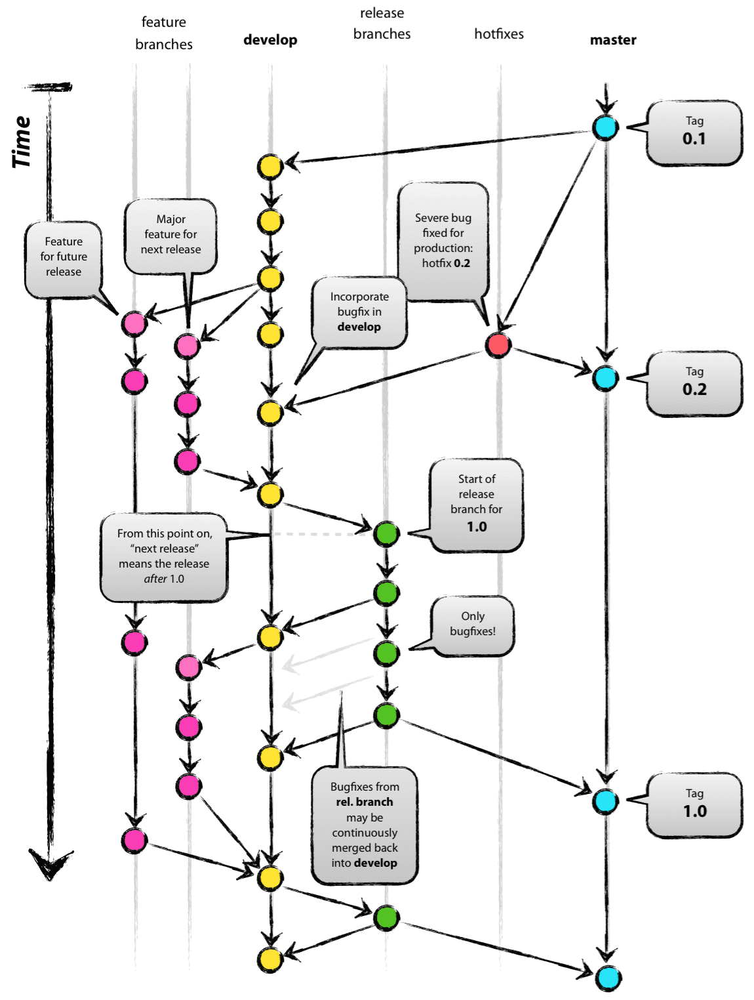
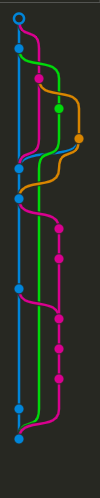
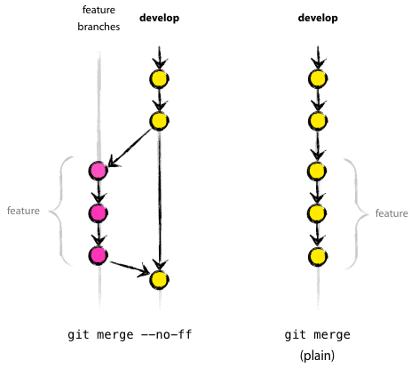

# git-flow

---



메인 브랜치: 항상 유지된다.

- master: 제품으로 출시될 수 있는 브랜치
- develop: 개발 브랜치로 개발자들이 이 브랜치를 기준으로 각자 작업한 기능들을 합(Merge)친다.

보조 브랜치: merge되면 사라진다.

- feature: 기능을 개발하는 브랜치. 완료되면 develop 브랜치에 합친다.
- release: 배포를 위해 master 브랜치로 보내기 전에 먼저 QA(품질검사)를 하기위한 브랜치 입니다.
- hotfix: master 브랜치로 배포를 했는데 버그가 생겼을 떄 긴급 수정하는 브랜치 입니다.

총 이렇게 5개의 브랜치들을 사용한다.

---

### 기본 프로세스

1. 개발자는 develop 브랜치로부터 본인이 개발할 기능을 위한 feature 브랜치를 만든다.
2. feature 브랜치에서 기능을 만들다가, 기능이 완성되면 develop 브랜치에 merge한다.
3. 이번 배포 버전의 기능들이 develop 브랜치에 모두 merger 됐다면, QA를 위해 release 브랜치를 생성한다.
4. release 브랜치에서 오류가 발생한다면, release 브랜치 내에서 수정한다. 마침내 QA가 끝났다면, 해당 버전을 배포하기 위해 master 브랜치로 merge 한다. bigfix가 있었다면 해당 내용을 반영하기 위해 develop 브랜치에도 merge 한다.
5. 만약 제품(master)에서 버그가 발생한다면, hotfix 브랜치를 만든다.
6. hotfix 브랜치에서 버그 픽스가 끝나면, develop과 master 브랜치에 merge 한다.

---



나 혼자하는 토이프로젝트에서 이런 사태가 발생했다. git을 제대로 이해하지 않고 쓴 결과물이다... 이 결과물이 해당 문서를 작성하는 이유이다. 내가 이해할 수 있게 쉽게 하나씩 설명해나가겠다.



보통 실제 개발을 develop 브랜치에서 시작하게 된다. 내가 만약 navbar를 만들어야 한다면 해당 feature에 대한 브랜치가 필요하다.

어떻게 브랜치의 이름을 네이밍하냐는 개인 혹은 팀의 마음이겠지만, 일단 기본적으로 feature라는 prefix를 사용해야 한다. 

`feature/navbar`라는 브랜치를 사용하기로 결정했다고 가정한다.

1. `git checkout -b "feature/navbar"`로 해당 브랜치를 만든다. 이때 반드시!!!!!! 지금 브랜치가 develop 인 것을 확인하고 해야 한다. 나같은 경우에 이거를 확인안하고 하다가 저 위의 사진처럼 난리가 났다.
2. `git add ~~~` 무언가 add 한다.
3. `git commit -m "feat: ~~~"` 커밋 메시지를 남긴다.
4. `git push origin feature/navbar` 원격저장소의 이름이 origin으로 등록되어 있다고 가정한다. 결국 이 명령어는 origin으로 명명된 원격 저장소에 feature/navbar 브랜치의 내용을 PR 하겠다는 뜻이다.

이렇게 하면 깃허브에 PR 만드는 창이 뜰 것이고 그곳에서 PR을 만들고, 코드 리뷰를 받고, 머지하면된다.

이렇게 머지가 완료되면 develop 브랜치에서 만들어진 feature/navbar 브랜치는 다시 develop 브랜치 안으로 들어가게 된다.

하지만, 만약에!! 이런 식의 merge가 불가능한 경우에는 어떻게 할까?

예를 들어, release 브랜치에서 수정을 하고  PR을 올려서 머지가 수행되면, 당연히 relase 브랜치가 만들어진 develop 브랜치로만 머지가 되어 버린다. 하지만, 실제로는 master 브랜치에서도 이 release 브랜치의 내용이 필요하게 된다.

이 경우 `git merge <가져올 브랜치 이름>` 를 사용한다.

즉, `git switch master`를 통해 master 브랜치로 이동하고, 그곳에서 `git merge release` 명령어를 치게 되면 master 브랜치로 release 브랜치를 가져오게 된다.

---

### 기억해야할 명령어/ 에러 상황과 해결 방법

`git remote -v` - 해당 폴더에 연결된 레포의 주소와 연결한 이름을 알려준다. (보통 나는 origin으로 많이 설정한다.)

`git checkout -b <브랜치이름>` - 해당 이름의 브랜치를 만들고 그 브랜치로 바꾼다.

`git log` - 로그를 보여준다.

`git clone -b <브랜치 이름> <레포 주소>` - 이렇게 하면 특정한 레포의 특정한 브랜치를 클론해올 수 있다. b flag 없이 클론하면 default로 설정되어있는 브랜치를 클론하게 된다.

---

### PR을 올렸는데 그곳에서 팀원분이 코드 수정을 요청한다면 어떻게 할까?

나는 해당 PR을 closed하고 다시 PR을 올려야 한다고 생각했다. 하지만, 실제로 그렇게 해보니 closed한 PR에서 커밋한 내용들이 이번에 다시 올리는 PR에서는 반영되지 않았다. 때문에 팀원분들에게 도움을 요청했고 다음과 같은 점들을 배웠다.

- 수정이 필요한 PR을 닫을 필요 없다.
- 해당 브랜치에서 수정 작업을 하고 다시 push를 하면 두 번의 push가 모두 반영되게 된다.

이때 두 번의 push에서 충돌이 발생할 수 있다. 

나의 경우에는 다음과 같은 에러가 났다.

```
 ! [rejected]        feature/layout -> feature/layout (non-fast-forward)
error: failed to push some refs to 'https://github.com/meet-in-ssafy/service.git'
```

해당 에러가 발생하는 경우 브랜치 이름 앞에 +를 붙여주면 된다.

ex) `git push origin +feature/layout`    // 이런 식이 되겠다.

---

### 라벨 태그를 활용하자

현재 진행 중인 프로젝트에서는 `done` 이라는 라벨 태그를 사용하고 있다.

나는 PR이 올라오면 습관적으로 모두 approve를 눌러왔는데 PR은 일회성에 그친다고 생각했기 때문이다.

하지만, 바로 위의 경우에서 PR을 닫거나 머지하기 전까지 계속해서 커밋을 보낼 수 있다는 사실을 알게 되었다.

때문에, 해당 PR에서도 내용이 지속적으로 커밋될 수 있고 다른 팀원분들은 이 경우 `done` 라벨을 붙이지 않으셨다. 나 또한 `done` 라벨이 붙지 않은, 즉 끝나지 않은 PR에 대해서는 approve를 누를 필요가 없었다.

앞으로는 라벨을 잘 확인하고 이 점을 주의해야 한다.

