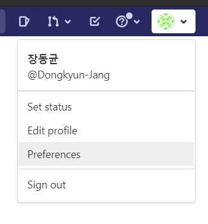
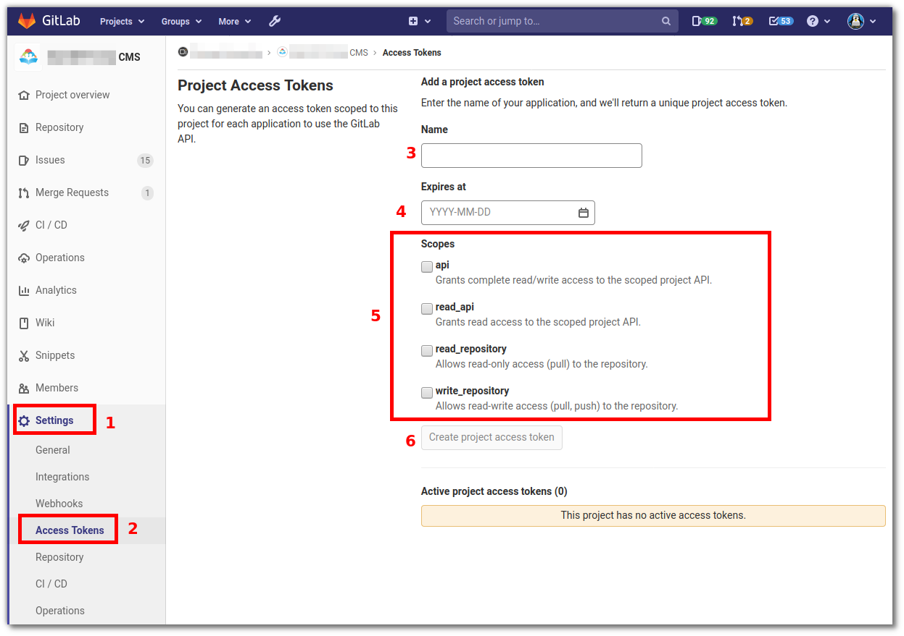
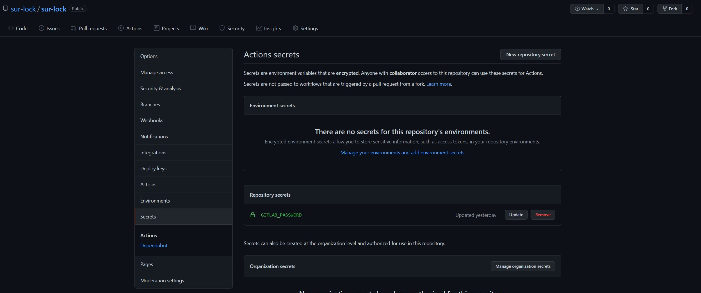
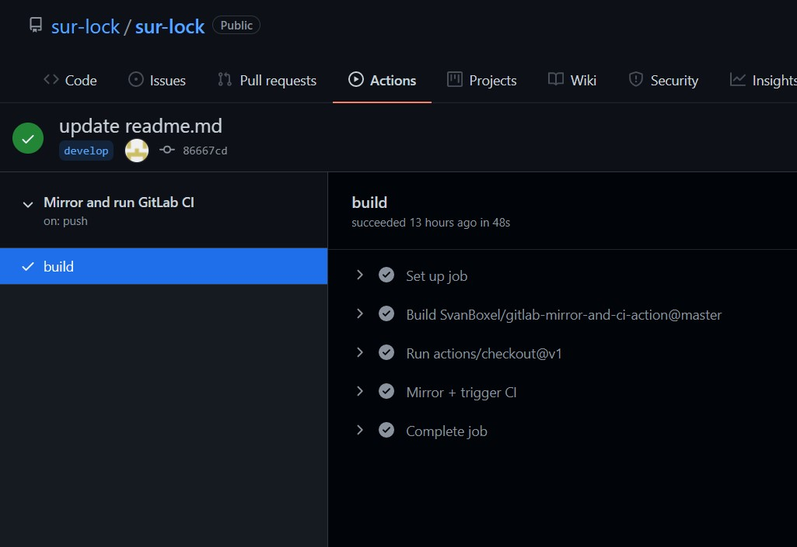
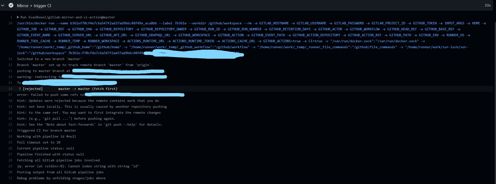
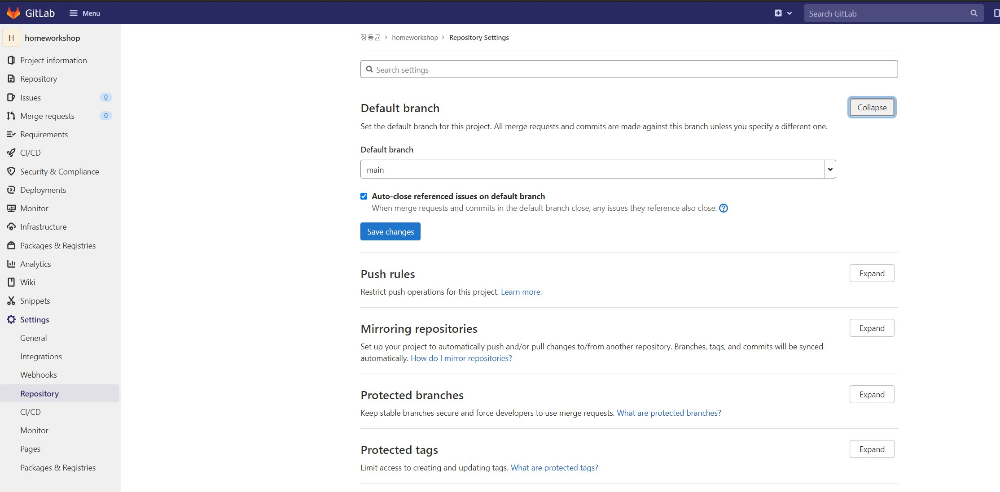
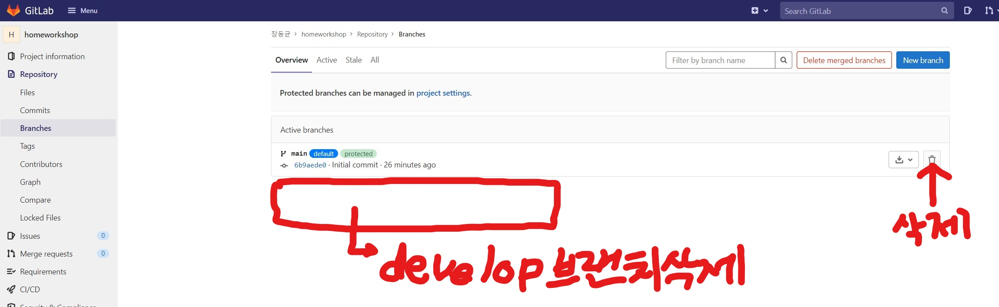

# 🎉gitlab과 github 미러링하기

> 깃허브에서 프로젝트를 진행하면서 내 깃랩에도 같은 기록을 남기고 싶다는 요구가 생겼다. 때문에 
>
> 1. 내가 깃허브에 파일을 올린다.
> 2. 자동으로 그 파일들이 깃랩에도 올라간다.
>
> 해당 플로우에 대한 자동화가 필요했고, 이를 수행했다. 
>
> 다음에도 해당 기능이 필요할 수 있기 때문에 정리해둔다.

---

일단 기본적으로 gitlab에 push를 했을 때 해당 내용이 github에 반영되게 하는 기능은 gitlab 자체에서 제공하는 것 같다.

https://velog.io/@ssmin0606/%EA%B0%9C%EB%B0%9C%ED%88%B4-Gitlab-Github-%EB%AF%B8%EB%9F%AC%EB%A7%81-%EC%84%A4%EC%A0%95

해당 블로그에 이에 대한 과정이 자세하게 설명되어있기 때문에 이를 확인하고 사용하면 되겠다.

해당 글에서는 github에 push를 했을 때 해당 내용이 gitlab에 반영되도록 하는 플로우를 설명한다. 

---

### trigger GitLab CI 코드

기본적으로 해당 [깃헙](https://github.com/SvanBoxel/gitlab-mirror-and-ci-action)의 파일을 사용하였습니다.

```yaml
name: Mirror and run GitLab CI

on: [push]

jobs:
  build:
    runs-on: ubuntu-latest
    steps:
    - uses: actions/checkout@v1
    - name: Mirror + trigger CI
      uses: SvanBoxel/gitlab-mirror-and-ci-action@master
      with:
        args: "https://gitlab.com/<namespace>/<repository>"
      env:
        GITLAB_HOSTNAME: "gitlab.com"
        GITLAB_USERNAME: "svboxel"
        GITLAB_PASSWORD: ${{ secrets.GITLAB_PASSWORD }} 
        GITLAB_PROJECT_ID: "<GitLab project ID>" 
        GITHUB_TOKEN: ${{ secrets.GITHUB_TOKEN }} 
```

실제 사용 예시

```yaml
name: Mirror and run GitLab CI

on: [push]

jobs:
  build:
    runs-on: ubuntu-latest
    steps:
      - uses: actions/checkout@v1
      - name: Mirror + trigger CI
        uses: SvanBoxel/gitlab-mirror-and-ci-action@master
        with:
          args: "https://gitlab.com/toypjt/whereismycat"
        env:
          GITLAB_HOSTNAME: "gitlab.com"
          GITLAB_USERNAME: "Dongkyun-Jang"
          GITLAB_PASSWORD: ${{ secrets.GITLAB_PASSWORD }}
          GITLAB_PROJECT_ID: "63249"
          GITHUB_TOKEN: ${{ secrets.GITHUB_TOKEN }}
```

> 이번에 새로 알게된 사실이 깃허브 레포에 `.github/workflows` 해당 폴더를 만들고 yml 형식의 파일을 두면 깃허브가 자동으로 해당 yml 파일을 트리거 시키게된다.
>
> 때문에 위의 파일을 `.github/workflows/mirror-to-gitlab.yml`에 작성하여 사용하였다.

크게 우리가 작성해야 하는 부분은 5가지 이다.

1. args: 깃허브에 푸시가 된 내용이 자동으로 푸시되어야 하는 깃랩의 레포 주소를 작성

2. GITLAB_HOSTNAME: 기존적으로 `gitlab.com` 이지만 기관에서 사용하는 깃랩 유료 버전의 경우 해당 호스트네임이 바뀔 수 있으며 이 경우 위의 args를 통해 파악하면 되겠다.

3. GITLAB_USERNAME: 자신의 깃랩 닉네임을 적으면 된다.

   > 

4. GITLAB_PASSWORD: 내가 만든 깃랩 레포에 깃허브가 자동으로 접근할 수 있도록 토큰을 가져와 등록해야 한다.

   > 
   >
   > 이런식으로 깃랩에서 Access Token을 발행한다. 이 때 깃허브에서 깃랩에 푸시할 수 있는 권한이 있어야 한다. 때문에 api, read_api, read_repository, write_repository 까지 모든 권한을 다 줘버리자.
   >
   > 
   >그 다음 발행된 키를 깃허브 레포에 등록한다.
   >
   > 
   >
   > 레포의 Settings => Secrets 로 온 다음,
   >
   > 이런식으로 위의 파일 설정에서 사용한 이름과 같게 깃랩의 토큰을 깃허브에 등록한다.
   >
   > `secrets.GITLAB_PASSWORD` 라는 이름을 사용했기 때문에 `GITLAB_PASSWORD`라는 이름으로 저장해 둔 것이다.

---

위의 플로우를 모두 수행하게 되면 push가 발생할 때마다 다음과 같은 깃허브 액션이 동작한다.



Mirror + trigger CI 탭을 열어보면 깃랩에 푸시가 정상적으로 이루어졌음을 확인할 수 있다.

---

## 우리가 겪었던 문제!!!



이런 식으로 계속해서 자동 푸시가 reject 되었다.

조금 더 우리의 상황을 자세하게 설명하면 다음과 같았다. 

급하게 먼저 깃랩에 파일을 넣어야 해서 CRA를 통해 프로젝트를 만들고 깃랩에 먼저 푸시를 했다. 이 이후에 깃랩과 깃허브를 연동시켰고 깃허브에 푸시를 하니 당연히 깃허브에는 정상적으로 푸시되었지만 해당 내용이 자동으로 깃랩에 푸시될 때 reject가 나는 상황이었다.

이를 해결하기 위해서는 깃랩에서 깃허브를 한번 `git pull` 해야 하는데 둘 사이는 자동화되어 있기 때문에 이를 건들이는 일이 쉽지 않았다. 그러다 조언을 구하게 되었고 해결방안을 얻을 수 있었는데 바로 깃랩의 브랜치를 지워버리는 것이다. 

### 자세한 해결 방법은 다음과 같다.

만약 깃랩의 default 브랜치가 develop이고 깃허브의 default 브랜치 또한 develop인 상황에서 위와 같은 문제가 발생한다고 가정한다.

github의 develop => gitlab의 develop 으로의 push는 당연히 에러가 난다. 이미 깃랩에는 다른 폴더가 있기 때문에!! 이 떄문에 우리는 깃랩에 특별한 수정을 해주어야 한다.


1. 디폴트 브랜치를 일단 아무 다른 브랜치로 옮긴다. (다른 브랜치가 없다면 임시로 아무거나 하나 만들어라.)



2. 디폴트 브랜치인 develop 브랜치를 삭제한다.



3. 그 다음 다시 깃허브에 푸시한다.
4. 깃랩의 디폴트 브랜치를 다시 원래대로 develop으로 바꿔준다.

이렇게 하면 기존에 가지고 있었던 문제를 해결할 수 있다. 깃랩의 develop 브랜치가 아예 존재하지 않기 때문에 3번의 요청에 의해 아예 새로운 브랜치가 생성되고, 새로운 브랜치에는 아무 파일도 없기 때문에 해당 브랜치에 정상적으로 파일들이 푸시될 것이다.

