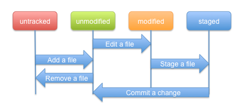
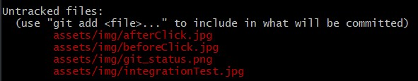
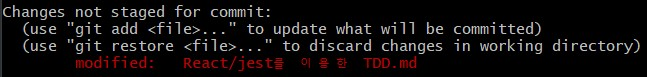
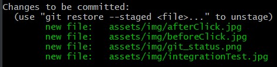

# 💥지옥에서 온 깃 요약

> 프로젝트를 진행하면서 깃에 대해 많이 배웠지만, 뭔가 제대로 알지 못한 상태에서 사용하고 있는 것 같은 느낌을 너무 많이 받아왔다. 이 때문에 예전에 사두었지만 아직 제대로 읽지는 못한 **지옥에서 온 문서 관리자 깃 & 깃허브 입문(이지스 퍼블리싱)** 을 읽고 새롭게 알게된 점이나 팁들을 정리해두고자 한다.

---

파일들의 상태는 이렇게 4가지로 구분된다.

untracked

> 새롭게 만들어진 파일
>
> 

modified

> 수정된 파일
>
> 

staged

> `$git add` 명령어를 통해 스테이징된 상태
>
> 

---

### 스테이징 되돌리기

`hello.txt`라는 파일을 작성하고 `git add`했다고 가정한다. 그렇다면 해당 파일은 스테이징 상태가 될 것이다. 

해당 파일의 스테이징은 어떻게 되돌릴 수 있을까?

`$git reset HEAD hello.txt` 명령어를 통해 스테이징을 되돌릴 수 있다.

물론, vsCode에서 - 버튼만 클릭하면 해당 기능을 똑같이 수행할 수도 있다.

---

###  최신 커밋 되돌리기

이번에는 `hello.txt`라는 파일을 작성하고 `$git commit -am`으로 add와 commit을 동시에 진행했다고 가정한다.

`$git log` 명령어를 통해 최상단에 방금 수행한 커밋이 올라와 있음을 확인할 수 있을 것이다.

그렇다면 해당 커밋을 취소하려면 어떻게 해야 할까?

`$git reset HEAD^` 명령어를 통해 가장 최근에 한 커밋을 취소할 수 있다.

만약, 가장 최근에 한 3개의 커밋을 취소해야 한다면 다음과 같은 명령어를 사용한다.

`$git reset HEAD~3`

아무런 옵션 없이 reset 명령어를 사용하게 되면 커밋이 취소되는 것 뿐만 아니라, 스테이징 상태도 풀리게 된다. 쉽게 말해서 `commit`도 취소하고 `add`도 취소하는 것이다.

물론, 옵션을 통해 커밋만 취소하는 방법 또한 존재한다.

| 명령          | 설명                                                         |
| ------------- | ------------------------------------------------------------ |
| --soft HEAD^  | 최근 커밋을 하기 전 상태로 작업 트리를 되돌린다. (commit만 취소) |
| --mixed HEAD^ | 최근 커밋과 스테이징을 하기 전 상태로 작업 트리를 되돌린다. 해당 옵션이 디폴트값이다. (commit, add 취소) |
| --hard HEAD^  | 최근 커밋과 스테이징, 파일 수정을 하기 전 상태로 작업 트리를 되돌린다. (commit, add, 파일을 수정했던 기록까지 취소) 이 옵션으로 되돌린 내용은 복구할 수 없다. |

hard 옵션은 굉장히 위험하기도 하고 사실상 파일을 수정했던 기록까지 날려야 하는 경우는 거의 없을 것 같아서 쓸 일이 있을까 싶다.

---

### git merge

해당 명령어를 통해 지금의 브랜치에서 다른 브랜치를 가져와 통합시킬 수 있다.

하지만, PR을 하게 되는 경우 코드 리뷰 이후에 깃허브에서 merge 버튼을 클릭하여 직접 병합과정을 거치게 된다.

보통 PR을 올릴 때 해당 명령어를 사용하게 된다.

`$git push <병합을 하는 브랜치> <병합을 당하는 브랜치>`

팀구 프로젝트에서 `$git push origin feature/*`과 같은 명령어를 통해 develop 브랜치에 병합시킬 수 있었던 이유는 origin에 해당 프로젝트의 주소가 등록되어 있고, 해당 프로젝트의 default 브랜치가 develop이었기 때문에 자동으로 develop 브랜치에 병합된 것이다.

만약에, master 브랜치에 병합이 되어야 하는 코드라면 `$git push master feature/*`과 같이 명령어를 작성해주어야 한다.

---

### 브랜치 생성 이동

`$git branch <브랜치 이름>`    // 브랜치 생성

`$git checkout <브랜치 이름>`    // 해당 브랜치로 이동

`$git chechout -b <브랜치 이름>`    // 해당 브랜치를 만들고 그 브랜치로 이동

`$git branch -d <브랜치 이름>`   

> 브랜치 삭제의 경우, 저장소의 기본 브랜치로 와서 수행해야 한다.
>
> 또한, 삭제한 브랜치는 같은 이름으로 다시 브랜치를 만들면 예쩐에 작업했던 내용이 그대로 나타난다. 즉, 브랜치를 삭제한다는 거은 완전히 저장소에서 없애는 것이 아니라 깃의 흐름 속에서 감추는 것이라고 생각하는 것이 좋다.

---

