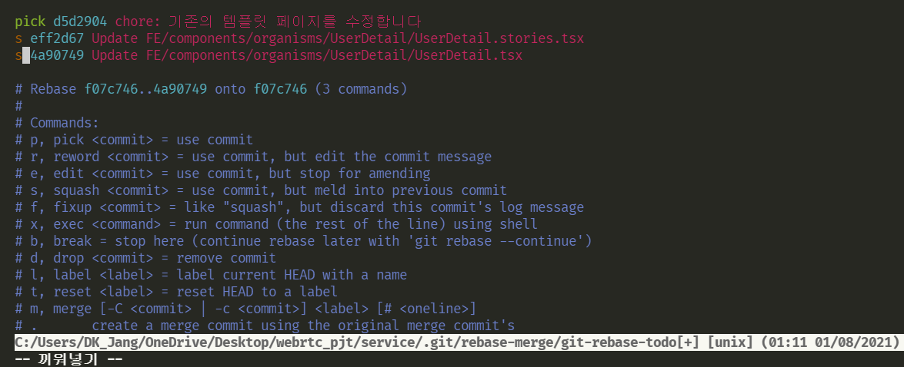

# 😒git을 쓰면서 겪은 문제 상황과 해결 방법을 기록하자

---

### 기억해야할 명령어/ 에러 상황과 해결 방법

`git remote -v` - 해당 폴더에 연결된 레포의 주소와 연결한 이름을 알려준다. (보통 나는 origin으로 많이 설정한다.)

`git checkout -b <브랜치이름>` - 해당 이름의 브랜치를 만들고 그 브랜치로 바꾼다.

`git log` - 로그를 보여준다.

`git clone -b <브랜치 이름> <레포 주소>` - 이렇게 하면 특정한 레포의 특정한 브랜치를 클론해올 수 있다. b flag 없이 클론하면 default로 설정되어있는 브랜치를 클론하게 된다.

`git log --oneline` 커밋 목록을 깔끔하게 보여준다.

---

### PR을 올렸는데 그곳에서 팀원분이 코드 수정을 요청한다면 어떻게 할까?

나는 해당 PR을 closed하고 다시 PR을 올려야 한다고 생각했다. 하지만, 실제로 그렇게 해보니 closed한 PR에서 커밋한 내용들이 이번에 다시 올리는 PR에서는 반영되지 않았다. 때문에 팀원분들에게 도움을 요청했고 다음과 같은 점들을 배웠다.

- 수정이 필요한 PR을 닫을 필요 없다.
- 해당 브랜치에서 수정 작업을 하고 다시 push를 하면 두 번의 push가 모두 반영되게 된다.

이때 두 번의 push에서 충돌이 발생할 수 있다. 

나의 경우에는 다음과 같은 에러가 났다.

```
 ! [rejected]        feature/layout -> feature/layout (non-fast-forward)
error: failed to push some refs to 'https://github.com/meet-in-ssafy/service.git'
```

해당 에러가 발생하는 경우 브랜치 이름 앞에 +를 붙여주면 된다.

ex) `git push origin +feature/layout`    // 이런 식이 되겠다.

---

### 라벨 태그를 활용하자

현재 진행 중인 프로젝트에서는 `done` 이라는 라벨 태그를 사용하고 있다.

나는 PR이 올라오면 습관적으로 모두 approve를 눌러왔는데 PR은 일회성에 그친다고 생각했기 때문이다.

하지만, 바로 위의 경우에서 PR을 닫거나 머지하기 전까지 계속해서 커밋을 보낼 수 있다는 사실을 알게 되었다.

때문에, 해당 PR에서도 내용이 지속적으로 커밋될 수 있고 다른 팀원분들은 이 경우 `done` 라벨을 붙이지 않으셨다. 나 또한 `done` 라벨이 붙지 않은, 즉 끝나지 않은 PR에 대해서는 approve를 누를 필요가 없었다.

앞으로는 라벨을 잘 확인하고 이 점을 주의해야 한다.

---

### 가장 최근에 한 커밋 삭제하기

`git reset HEAD^`

해당 명령어를 사용하면 가장 최근에 한 커밋, 즉 HEAD에 존재하는 커밋이 삭제된다.

`git reset HEAD~<숫자>`

<숫자>개 만큼의 최근 커밋들이 삭제된다.

reset 옵션

| 명령          | 설명                                                         |
| ------------- | ------------------------------------------------------------ |
| --soft HEAD^  | 최근 커밋을 하기 전 상태로 작업트리 되돌리기                 |
| --mixed HEAD^ | 최근 커밋과 스테이징을 하기 전 상태로 작업트리 되돌리기(디폴트 옵션) |
| --hard HEAD^  | 최근 커밋과 스테이징, 파일 수정을 하기 전 상태로 되돌리기(복구 불가) |

---

### 가장 최근에 한 커밋을 수정하기

이 경우 크게 두가지로 나뉠 수 있다. 하나는 단순히 커밋 메시지만을 수정하는 것, 다른 하나는 나중에 수정한 파일을 마지막 커밋 안에 밀어넣는 것이다.

커밋 메시지를 수정하는 방법은 간단하다.

`git commit --amend`

해당 명령어를 입력하면 마지막 커밋 메시지가 텍스트 편집기로 열린다. 거기에서 vi editor로 수정하면 된다.

반대로 커밋 메시지를 바꿔야 하는 것이 아니라, 수정된 프로젝트 내용을 해당 커밋 안으로 밀어넣어야 하는 경우가 존재한다. 이 경우 또한 기본적으로 방법은 동일하다. 

1. 파일을 수정하고 `git add`로 수정된 부분을 staging area로 넣는다.
2. `git commit --amend` 명령으로 맨 마지막 커밋을 열고, 수정이 필요하다면 수정을 하고 그렇지 않다면 바로 `:wq` 명령어로 저장한다.

이렇게 하면 맨 마지막 커밋이 수정되면서 staging area에 있던 수정된 파일 또한 해당 커밋 안으로 밀어넣어진다.

---

### 여러 개의 커밋 하나로 합치기


다음과 같은 상황이다. 맨 위의 두 개의 커밋이 기본적으로 지켜야 할 컨벤션을 지키지 않고 있다.

그렇다면 왜 저러한 커밋이 생긴것이냐!!!!!!??

바로 PR 코드 리뷰과정에서 발생한 것이다. 다른 팀원분이 더 좋은 코드를 제시해주시면 나는 해당 코드를 깃허브 페이지에서 바로 커밋해서 반영시킬 수 있다. (정확히 이 시점에서 내가 커밋 메시지를 다시 정할 수 있는 지는 모르겠다. 하지만, 어짜피 해당 커밋들은 불필요하게 생긴 커밋들이며 다른 커밋들과 합쳐질 필요가 있다.)

이때 다음과 같은 커밋 메시지가 생기게 되었고 이들을 수정할 필요가 생겼다.

이때 사용할 수 있는 명령어는 다음과 같다.

`git rebase -i HEAD~<숫자>`


나는 `git rebase -i HEAD~3` 명령어를 사용하였다. 이렇게 하면 HEAD를 포함한 3개의 커밋이 이런 식으로 나온다.

만약 d5d2904 안으로 eff2d67과 4a90749를 집어 넣고 싶다면 어떻게 해야 할까.



이런 식으로 들어가야 하는 커밋의 맨 앞을 s로, 들어가는 곳이 되는 커밋의 맨 앞은 pick 그대로 둔다.

여기서 s는 squash 라는 단어로 의미는 use commit, but meld into previous commit 이다. 즉, 이전 커밋으로 녹아들어가게 된다.

이후 :wq 옵션으로 저장하고 나오면 다음과 같은 화면이 나온다.


이전에 합치기 위해 열었던 3개의 커밋 메시지가 한번에 나온다. 우리는 아래 두 개의 커밋 메시지를 위에 하나로 합치려고 한다. 떄문에 다음과 같이 수정한다.


이렇게 하면 3개의 커밋이 해당 커밋 메시지를 가진 하나의 커밋으로 통합된다. 다시 :wq 옵션으로 저장하고 나온다.


당연히 나왔으니 다시 push해야 하는데 당연히 충돌이 발생할 것이다. 때문에 -f 옵션을 주어서 강제로 밀어 넣어야 한다.

이점 떄문에 develop이나 master 브랜치에서 rebase 명령어를 사용하는 것은 굉장히 위험할 수도 있다고 한다.

https://madplay.github.io/post/squash-git-commits-with-rebase

http://hong.adfeel.info/git/git-rebase-i-%EB%A1%9C-commit-%ED%95%A9%EC%B9%98%EA%B8%B0/

---

## 참고자료

https://git-scm.com/book/ko/v2/Git-%EB%8F%84%EA%B5%AC-%ED%9E%88%EC%8A%A4%ED%86%A0%EB%A6%AC-%EB%8B%A8%EC%9E%A5%ED%95%98%EA%B8%B0

