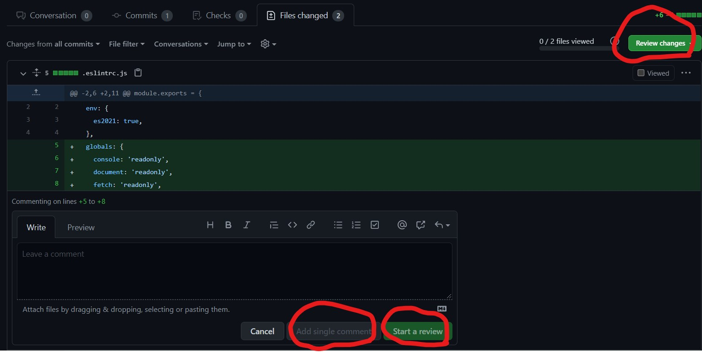
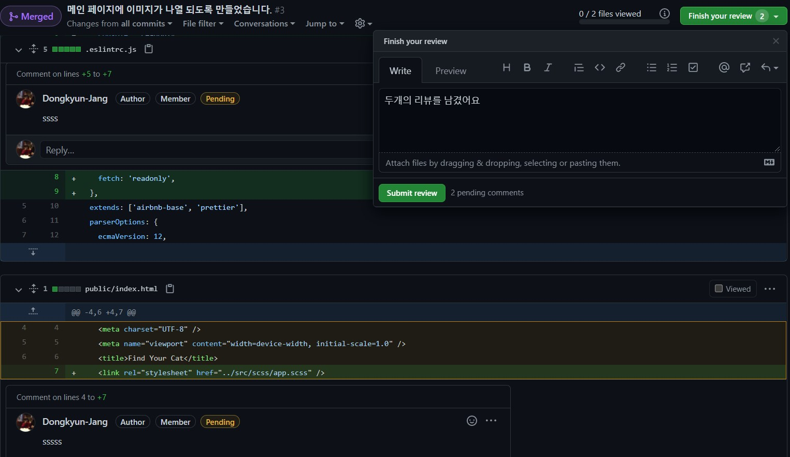
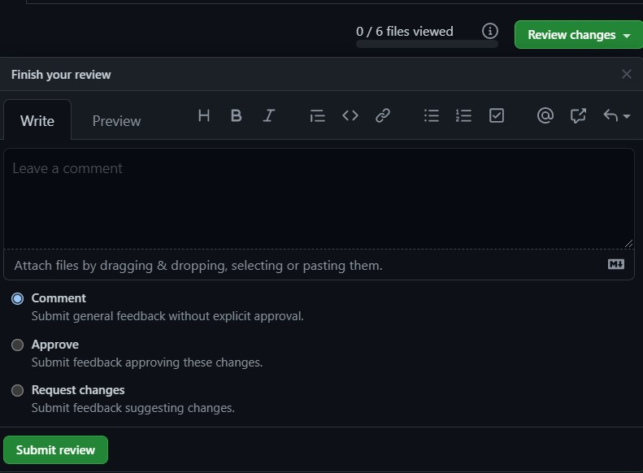
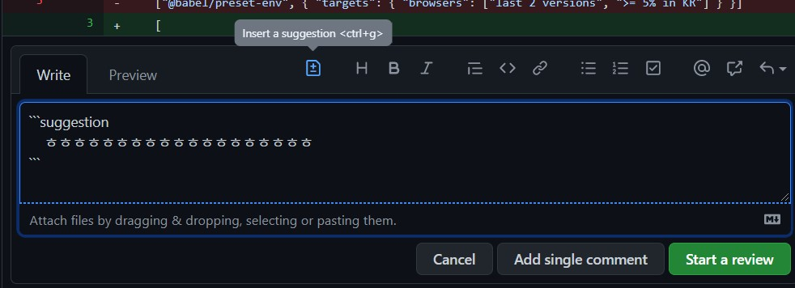
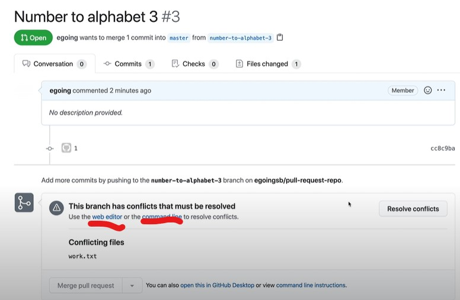
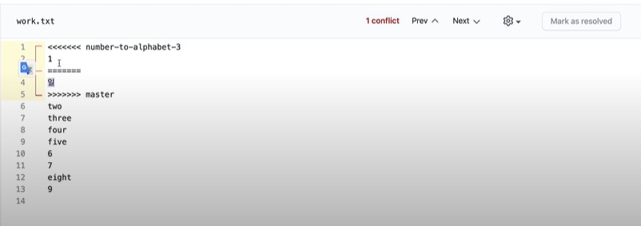
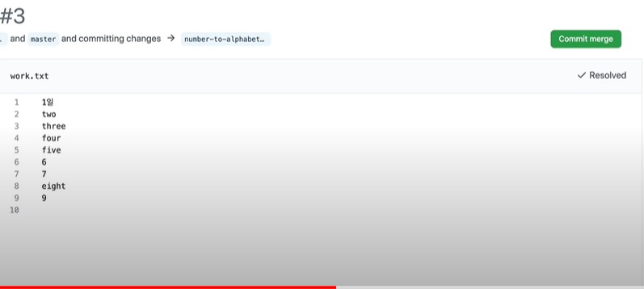

# 🧨Pull Request 사용하기

> 항상 혼자 공부하다 보니 이런 기능을 사용할 일이 없었다. 하지만, 이번에 스터디원분들과 바닐라 자바스크립트 프로젝트를 시작하면 서로가 코드 리뷰할 필요가 생겼고 때문에 이 기능이 필요해져서 공부하게 되었다.
>
> 모든 내용은 유튜브 생활코딩의 git pull request 강의를 참조한 것이다.

---

### 기본 명령어

가장 기본적으로 활용되는 명령어들은 다음과 같다.

- git checkout -b <브랜치이름>

  > git checkout은 브랜치 전환 명령어. -b 옵션을 주게 되면 브랜치를 만들면서 해당 브랜치로 전환하게 된다.

- git commit -am "<커밋 메세지>"

  > -am 옵션을 주면 add와 commit을 동시에 진행할 수 있다.

- git push <저장소명> <브랜치명>

  > ex) git push origin master (master 브랜치에서 바뀐 내용을 origin 저장소에 올리겠다.)
  >
  > `git push -u <저장소명> <브랜치명>` 이렇게 딱 한번만 u 옵션을 줘서 push하면 그 이후로는 저장소명과 브랜치명이 같다면 간단하게 `git push`만 적으면 된다.

---

### 깃허브에서 소통하기



가장 기본이 되는 화면이다. 우리는 상대방의 코드에 comment를 남길 때 선택 할 수 있는 두 가지 옵션을 가진다.

- Add single comment

  > 딱 해당 코드 부분에만 comment를 남기고 싶고, 다른 코드 부분에는 comment를 남길 필요가 없을 때 활용한다. 버튼을 누르게 되면 바로 반영이 된다.

- Start a review

  > 여러 코드 부분에 comment를 남기고 싶을 때 사용한다. 바로 반영이 되지 않으며, 여러 코드 부분에 comment를 다 남기고 우측 상단에 Review changes를 눌렀을 때, 그떄 반영된다.

  

  두 개의 코드 부분에 comment를 단 모습이다. Review changes 버튼이 Finish your review로 바뀌었고 옆에 내가 몇 개의 comment를 달았는지 친절하게 알려준다.

위의 사진은 이미 merged된 commit에 단 comment이기 때문에 Review changes를 눌렀을 때 옵션이 나오지 않지만, 실제로 아직 의견을 받고 있는 pr의 경우에는 이렇게 3가지 옵션이 나온다.



사실 세 개 모두 강제성은 없기 때문에 뭘 선택해도 문제를 일으키지는 않지만 경우에 맞는 옵션을 선택하는 것이 좋다.

- Comment - 단순한 피드백을 단 경우
- Approve - 해당 PR을 그냥 승인하고 싶은 경우
- Request change - 코드의 특정 부분에 대한 수정을 요청하고 싶은 경우

실제 코드 수정 요청은 다음과 같이 진행한다.



inser a suggestion 버튼을 누르면 아래에 템플릿이 나온다.

기존 코드가 `[`이었던 라인에 comment를 단다하면

```java
​```suggestion
	[
​```
```

이런 템플릿이 나온다. 만약 이 코드 부분이 `안녕하세요`로 수정되기를 바란다면

```
​```suggestion
	안녕하세요
​```
```

로 바꾸어서 comment를 달면 되는 것이다.

상대방은 이 수정 사항을 확인하고 반영할 수도 반영하지 않을 수도 있을 것이다.

---

### 깃 충돌 해결하기



git 충돌이 발생하였을 때 우리가 선택할 수 있는 선택지는 web editor를 사용하는 방법과 command line을 사용하는 방법 두가지가 존재한다. command line은 사용하기 조금 까다롭고 web editor로도 충분히 모든 충돌을 해결할 수 있을 것 같아 따로 정리하지는 않는다.

필요한 순간이 생기면 그때 [생활코딩님의 강의](https://www.youtube.com/watch?v=5FU-uyatBXc&list=PLuHgQVnccGMBXv1OKe3Hn3Jq6F735-uWm&index=6)를 다시 들어보면 되겠다.

web editor를 클릭하게 되면 우리는 다음과 같은 화면을 만날 수 있다.



두 브랜치에서 하나의 브랜치는 `1`로 수정하였고 다른 하나의 브랜치에서는 `일`로 수정하면서 생긴 충돌이다.



수정을 위해서는 해당하는 1-5행을 지우고 원하는 text를 입력하고 우측 상단의 Commit merge를 누르면 끝이다.

굉장히 간단하다.
