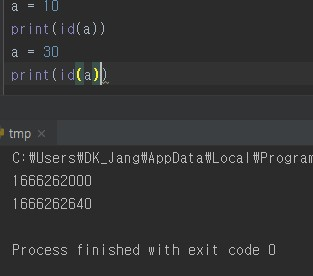

# ❓파이썬은 call by value일까 call by reference일까?

---

```python
def dfs():
	visited[0] = 123
	flag = 1
	print(id(visited)) #12220
	print(id(flag)) # 15
    
visited = [0] * 10
flag = 0
print(id(visited)) #12220
print(id(flag)) #8

print(visited[0]) #123
print(flag) #0

#visited는 가변 객체. 때문에 참조형으로 전달이 되고 이는 같은 id 값에서 확인할 수 있다.
#flag는 불변 객체. 때문에 전달을 위해 또 다른 객체가 생성되고 거기에 value가 복사된다. 이는 다른 id 값에서 
#확인할 수 있다.
```


내가 의문을 가졌던 코드.

flag의 값이 수정되지 않은 것은 이해가 간다. 다른 스코프를 가지기 때문에 dfs 함수 내부에서의 수정이 적용되지 않을 것이다. 그렇다면 왜? 배열의 경우에는 저렇게 수정이 이루어지는지 도무지 이해할 수 없었다.

때문에 C언어의 관점에서 `call by value`, `call by reference`의 차이인 것인가? 라는 생각을 바탕으로 여러 사이트들을 뒤졌다. 

결론은 !!! 파이썬은 `passed by assignment`라는 것이다.

즉, 어떠한 값을 전달하느냐에 따라 결과가 달라진다.

이 어떠한 값을 나누는 기준은 `mutable(가변)`이냐 `immutable(불변)`이냐 이다.

`int`, `str`과 같은 기본 타입들이 `immutable`

`list`, `dict`와 같은 타입들이 `mutable`이라고 한다.

근데.... 여기서 들었던 또 다른 의문이 있다. int가 불변이라고...?? 항상 값을 수정하면서 사용해왔는데...??? 라는 생각이 들었다.



이런 생각은 내가 파이썬을 제대로 몰랐기 때문에 들었던 생각이다.

int는 불변이 맞다. 변수에 할당된 int 타입이 새로운 int 타입으로 바뀔 때 나는 수정이 일어난다고 생각했다. 하지만, 현실은 사진과 같이 기존의 변수는 삭제되고 새로운 변수가 생겨나는 식으로 동작한다. 때문에 다른 id 값이 출력되는 것이다.

이러한 것들이 모두 가능한 이유는 파이썬에선 모든 것이 객체(Object)이기 때문이다.

때문에, int 타입의 변수를 넘기면 이 객체는 불변이기 때문에 함수 안에서 새로운 값을 형성하게 된다. 이는 마치 `call by value`와 같이 동작한다.

반면 가변 객체의 경우에는 새로 만들 필요가 없고, 참조형으로 가져오게 된다. 이는 마치 `call by reference`와 같이 동작한다. 위의 dfs 함수 내부에서 배열의 원소에 대한 수정이 가능했던 이유도 참조형으로 가져왔기 때문이다.


---

참고문헌

https://www.pymoon.com/entry/Python-%EC%9D%80-callbyvalue-%EC%9D%BC%EA%B9%8C-callbyreference-%EC%9D%BC%EA%B9%8C

https://hun-developer.tistory.com/2