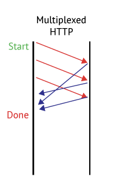

# HTTP/1.1과 HTTP/2.0, 그리고 간단한 HTTP/3.0

> http 완벽가이드 10장과 웹 성능 최적화 기법(루비페이퍼)을 요약하는 글입니다.

---

HTTP/1.1과 HTTP/2.0의 차이를 설명하는 가장 좋은 사진이다.

---

### HTTP/0.9

> GET 메서드만 가능. HTML 파일만 읽을 수 있을 뿐, 클라이언트의 정보를 서버에 전달할 방법 X. 또한 HTML 파일 중에서도 텍스트만 읽을 수 있음.

### HTTP/1.0

> POST 메서드의 추가. 덕분에 클라이언트의 정보를 전달할 수 있게 됨. HTML뿐만 아니라 이미지나 동영상 등 다양한 정보를 주고 받을 수 있게 됨. 

---

## HTTP/1.1의 등장

HTTP/1.1은 HTTP의 첫 번째 공식 표준 버전. GET, POST 외에도 PUT과 DELETE가 생김. 또한, 하나의 TCP 연결을 재사용해 많은 콘텐츠를 전달할 수 있는 지속적 연결 기술(keep alive)이 추가 되었다.

HTTP/1.1의 또 다른 특징 중 하나는 **파이프라이닝 기술** 이다. 파이프라이닝은 브라우저가 웹 서버에 여러 개의 콘텐츠를 요청했을 때, 이전 요청에 대한 응답을 완전하게 받지 않더라도 지속적 연결로 확보한 하나의 TCP 연결 내에서 미리 다음 요청에 대한 처리를 시작하면서 전체적인 전달 시간을 줄이는 방식이다.

이 사진이 이러한 HTTP/1.X의 특징을 잘 보여준다. Short-lived connections는 HTTP/1.0, 오른쪽 두 개는 HTTP/1.1에 해당한다.

Persistent Connection(Keep alive connection)(영속적인 커넥션)

>영속적인 커넥션은 얼마간 연결을 열어놓고 여러 요청에 재사용함으로써, 새로운 TCP 핸드셰이크를 하는 비용을 아끼고, 성능 향상에 기여할 수 있다. 커넥션이 영원히 열려있는 것은 아니며, 특정한 시간이 지나면 닫히게 된다. (서버는 Keep-alive 헤더를 사용해서 연결이 최소한 얼마나 열려있어야 할 지를 설정할 수 있다.)
>
>물론, 영속적인 커넥션도 단점을 가질 수 있다. 실제로 데이터를 보내지 않는 상황에서도 통신을 열어서 유지해야 하기 때문에 서버 리소스를 소비하게 된다.
>
>HTTP/1.0 커넥션은 기본적으로는 영속적이지 않지만, `Connection`을 `close`가 아닌 다른 것으로, 일반적으로 `retry-after`로 설정하면 영속적으로 동작한다.
>
>반면, HTTP/1.1은 기본적으로 영속적이다.

**HTTP 파이프라이닝**

> HTTP 파이프라이닝은 모던 브라우저에서 기본적으로 활성화 되어 있지 않다. 이는 모질라의 문서에 잘 나와 있다.
>
> - 버그가 있는 [프록시](https://en.wikipedia.org/wiki/Proxy_server)들이 여전히 많은데, 이들은 웹 개발자들이 쉽게 예상하거나 분석하기 힘든 이상하고 오류가 있는 동작을 야기합니다.
> - 파이프라이닝은 정확히 구현해내기 복잡합니다: 전송 중인 리소스의 크기, 사용될 효과적인 [RTT](https://en.wikipedia.org/wiki/Round-trip_delay_time), 그리고 효과적인 대역폭은 파이프라인이 제공하는 성능 향상에 직접적으로 영향을 미칩니다. 이런 내용을 모른다면, 중요한 메시지가 덜 중요한 메시지에 밀려 지연될 수 있습니다. 중요성에 대한 생각은 페이지 레이아웃 중에도 진전됩니다. 그러므로 파이프라이닝은 대부분의 경우 미미한 수준의 향상만을 가져다 줍니다.
> - 파이프라이닝은 [HOL](https://en.wikipedia.org/wiki/Head-of-line_blocking) 문제에 영향을 받습니다.
>
>   
>
> 이런 이유들로, 파이프라이닝은 더 나은 알고리즘인 멀티플렉싱으로 대체되었는데, 이는 HTTP/2에서 사용됩니다.

**도메인 샤딩**(도메인 분할 기법)(웹 최적화 기술 P.169 부터)

>도메인 분할 기법은 여러 도메인을 소유한 경우 웹 콘텐츠를 병렬적으로 동시에 다운로드할 수 있도록 하는 방법.
>
>브라우저는 동일 호스트명의 동시 연결 개수를 제한하는데, 한 도메인당 6~13개의 TCP 연결들을 동시 생성해 여러 리소스를 한 번에 다운로드 할 수 있도록 허용한다. 브라우저에서 허용하는 동시 연결 개수는 브라우저의 종류와 버전별로 차이가 있으며 최근 조사에 따르면 다음과 같다.
>
>| 브라우저 종류 | 최대 동시 연결 개수 |
>| ------------- | ------------------- |
>| IE 11.0       | 13                  |
>| 파이어폭스    | 6                   |
>| 크롬          | 6                   |
>| 사파리        | 6                   |
>| 오페라        | 6                   |
>| iOS           | 6                   |
>| Android       | 6                   |
>
>예를 들어 6개의 동시 연결을 지원하는 브라우저에서 도메인 샤딩을 이용해 2개의 도메인을 사용하게 된다면 이론적으로 12개의 연결이 가능해진다.
>
>만약, 우리가 www.feokorea.com이라는 사이트를 운영한다면 추가 도메인을 다음과 같이 디자인 할 수 있다.
>
>- www.feokorea.com : 웹 사이트 메인 페이지 및 동적 콘텐츠를 위한 도메인
>- img.feokorea.com : 이미지 호출을 위한 도메인
>- script.feokorea.com : 자바스크립트 파일, CSS와 같은 정적 콘텐츠를 위한 도메인
>- api.feokorea.com : API 서비스를 사용하기 위한 도메인
>
>이러한 도메인 샤딩은 사이트 전체의 쿠키 사이즈를 축소 시킬 수도 있다는 장점이 있다.
>
>도메인을 여러 개로 분할하는 방법은 기술적으로 크게 어렵지 않으나, 도메인을 몇 개로 윤용하는 것이 최적인지 결정하는 것은 쉽지 않은 문제이다.
>
>**도메인 샤딩이 고안된 이유는 HTTP/1.1의 가장 큰 문제점으로 지적되어온 Head of Line Blocking 현상 때문이다. HTTP/1.1에서 클라이언트와 서버 간의 연결은 마치 하나의 차선만 있는 도로와 같다. 클라이언트는 하나의 요청을 서버에 보내고 그에 대한 정상적 응답을 받은 후에야 다음 요청을 보낼 수 있기 때문이다. **
>
>**하지만, 이러한 문제점들은 HTTP/2의 멀티플렉싱 기술로 해결되었고 때문에 명확한 이유가 있는 것이 아니라면 도메인 샤딩을 쓰면 안된다. 도메인 샤딩을 사용하면 오히려 HTTP/2만의 특징인 헤더 압축, 우선순위 전송, 서버 푸시 기능을 방해하기 때문이다. 하지만, 예전 버전의 브라우저들은 아직 HTTP/2를 지원하지 않기 때문에 아직은 여러 개의 도메인이 필요할 수 있다.**
>
>**p.174에 따르면, 특정한 조건들을 지킨다면 최근 사용되는 브라우저에서는 HTTP/2의 기능을 저해하지 않으면서 다중 도메인을 사용할 수 있다고 한다.**
>
>Q. 그냥 무작정 많은 도메인을 사용하면 더 빨라지는거 아닌가?
>
>A. 아니다. 도메인 샤딩이 항상 좋은 것은 아니다. 브라우저는 해당 도메인의 IP 주소를 찾기 위해 DNS Lookup 과정을 거치게 된다. 때문에, 도메인이 많아 지면 많아 질 수록 이들에 대한 DNS Lookup을 위한 시간, connection을 유지하는데 드는 비용들이 필요해진다. 그래서 도메인이 많아지면 최초 initial load time이 길어질 수 있다. (뭐 그 이후에는 해당 IP를 캐싱할테니까.) 

---

## HTTP/2.0의 등장 배경

HTTP/1.1의 메시지 포맷은 구현의 단순성과 접근성에 주안점을 두고 최적화되었다. 그러다 보니 성능은 어느 정도 희생시키지 않을 수 없었다. 커넥션 하나를 통해 요청 하나를 보내고 그에 대해 응답 하나만을 받는 HTTP의 메시지 교환 방식은 단순했지만, 응답을 받아야만 그다음 요청을 보낼 수 있기 때문에 심각한 회전 지연(latency)을 피할 수 없었다.

때문에 더 효율적이고 빠른 HTTP가 필요했고 이러한 요구에 만들어진 것이 구글의 **SPDY** 프로토콜이다. 텍스트 방식의 프로토콜 메시지를 과감히 버리고 이진 포맷을 사용하면서 프로토콜 자체를 경량화하고자 했던 첫 시도이다. 이후 HTTP working group은 SPDY 프로토콜에 몇 가지 보안성을 보완해 새로운 정식 HTTP 버전을 제안했고, 이것이 HTTP/2이다.

HTTP/2.0은 서버와 클라이언트 사이의 TCP 커넥션 위에서 동작한다. 이때 TCP 커넥션을 초기화하는 것은 클라이언트이다.

HTTP/2.0 요청과 응답은 길이가 정의된 (최대 16383 (2^14 - 1) 바이트) 한 개 이상의 프레임에 담긴다. 프레임들에 담긴 요청과 응답은 스트림을 통해 보내진다. 한 개의 스트림이 한 쌍의 요청과 응답을 처리한다. 하나의 커넥션 위에 여러 개의 스트림이 동시에 만들어질 수 있으므로, 여러 개의 요청과 응답을 처리하는 것 역시 가능하다. 

HTTP/2.0은 이들 스트림에 대한 흐름 제어와 우선순위 부여 기능도 제공한다.

HTTP/2.0은 기존의 요청-응답과는 약간 다른 새로운 상호작용 모델인 서버 푸시를 도입했다. 이를 통해 서버는 클라이언트에게 필요하다고 생각하는 리소스라면 그에 대한 요청을 명시적으로 받지 않더라도 능동적으로 클라이언트에게 보내줄 수 있다.

---

### HTTP/1.1과의 차이점

---

1. #### 프레임

HTTP/2.0에서 모든 메시지는 프레임에 담겨 전송된다. 모든 프레임은 8바이트 크기의 헤더로 시작하여, 뒤이어 최대 16383 바이트 크기의 페이로드가 온다.

출처: https://developers.google.com/web/fundamentals/performance/http2/?hl=ko

---

2. #### 스트림과 멀티플렉싱

한 쌍의 HTTP 요청과 응답은 하나의 스트림을 통해 이루어진다. 클라이언트는 새 스트림을 만들어 그를 통해 HTTP 요청을 보낸다. 요청을 받은 서버는 그 요청과 같은 스트림으로 응답을 보낸다. 그러고 나면 스트림이 닫히게 된다.

HTTP/1.1에서는 한 TCP 커넥션을 통해 요청을 보냈을 때, 그에 대한 응답이 도착하고 나서야 같은 TCP 커넥션으로 다시 요청을 보낼 수 있다. 따라서 웹브라우저들은 회전 지연을 줄이기 위해 여러 개의 TCP 커넥션을 만들어 동시에 여러 개의 요청을 보내는 방법을 사용한다. 그러나 그렇다고 TCP 커넥션을 무한정 만들 수는 없기에 한 페이지에 보내야 할 요청이 수십개에서 수백개에 달하는 오늘날에는 회전 지연이 늘어나는 것을 피하기 어렵다. 

HTTP/2.0에서는 하나의 커넥션에 여러 개의 스트림이 동시에 열릴 수 있다. 따라서 하나의 HTTP/2.0 커넥션을 통해 여러 개의 요청이 동시에 보내질 수 있기 때문에 HTTP/1.1에서의 문제는 쉽게 해결 될 수 있다. 뿐만 아니라 스트림은 우선순위를 가질 수 있다. (그러나 이 우선순위에 따르는 것은 의무사항이 아니기 때문에, 요청에 우선순위대로 처리된다는 보장은 없다.)

모든 스트림은 31비트의 무부호 정수로 된 고유한 식별자를 갖는다. 스트림이 클라이언트에 의해 초기화되었다면 이 식별자는 반드시 홀수여야 하며 서버라면 짝수여야 한다. 또한, 새로 만들어지는 스트림의 식별자는 이전에 만들어졌거나 예약된 스트림들의 식별자보다 커야 한다. 한번 사용한 스트림 식별자는 다시 사용할 수 없다. 커넥션은 오래 사용하다보면 스트림에 할당될 수 있는 식별자가 고갈되기도 하는데, 그런 경우엔 커넥션을 다시 맺으면 된다.

---

3. #### 헤더 압축

HTTP/1.1에서 헤더는 아무런 압축 없이 그대로 전송되었다. 과거에는 웹페이지 하나를 방문할 때의 요청이 많지 않았기 때문에 헤더의 크기가 큰 문제가 되지는 않았다. 하지만, 요즘 웹페이지 하나를 보기 위해서는 수십, 수백 번의 요청을 보내기 때문에 헤더의 크기가 회전 지연과 대역폭 양쪽 모두에 실질적인 영향을 끼치게 된다.

이를 개선하기 위해 HTTP/2.0에서는 HTTP 메시지의 헤더를 압축하여 전송한다. 

HTTP/2는 클라이언트와 서버 사이에 가상 테이블을 만들어서 동일하고 중복되는 헤더 값들을 테이블에 저장하고 참고하는 방식으로 중복 전달을 제거한다.

가상 테이블은 정적 테이블과 동적 테이블로 나눌 수 있는데, 정적 테이블에는 미리 정의된 자주 사용되는 헤더 필드를 저장한다. 동적 테이블에는 클라이언트와 서버가 주고 받은 값들을 업데이트한다.

또한, 헤더 압축 알고리즘인 HPACK을 사용해 허프만 알고리즘 방식으로 헤더를 압축한다.

---

4. #### 서버 푸시

HTTP/2.0은 서버가 하나의 요청에 대해 응답으로 여러 개의 리소스를 보낼 수 있도록 해준다. 이 기능은 서버가 클라이언트에서 어떤 리소스를 요구할 것인지 미리 알 수 있는 상황에서 유용하다. 

예를 들어, HTML 문서를 요청 받은 서버는 그 HTML 문서가 링크하고 있는 이미지, CSS 파일, 자바스크립트 파일 등의 리소스를 클라이언트에게 푸시할 수 있을 것이다. 이는 클라이언트가 HTML 문서를 파싱해서 필요한 리소스를 다시 요청하여 발생하게 되는 트래픽과 회전 지연을 줄여준다.

---

### 알려진 보안 이슈

- 중개자 캡슐화 공격

  > HTTP/2.0 메시지를 중간의 프락시가 HTTP/1.1 메시지로 변환할 때 메시지의 의미가 변질될 가능성이 있다. HTTP/1.1과는 달리 HTTP/2.0은 헤더 필드의 이름과 값을 바이너리로 인코딩한다. 이는 HTTP/2.0이 헤더 필드로 어떤 문자열이든 사용할 수 있게 해준다. 이는 정상적인 HTTP/2.0 요청이나 응답이 불법적이거나 위조된 HTTP/1.1 메시지로 번역되는 것을 유발할 수 있다.
  >
  > 다행히 HTTP/1.1 메시지를 HTTP/2.0 메시지로 번역하는 과정에서는 이런 문제가 발생하지 않는다.

- 긴 커넥션 유지로 인한 개인정보 누출 우려

  > HTTP/2.0은 사용자가 요청을 보낼 때의 회전 지연을 줄이기 위해 클라이언트와 서버 사이의 커넥션을 오래 유지하는 것을 염두에 두고 있다. 이것은 개인 정보의 유출에 악용될 가능성이 있다. 이는 HTTP/1.1에서도 가지고 있는 문제이기는 하나, 짧게 유지되는 커넥션에서는 상대적으로 위험이 적다.

---

## HTTP3의 등장

HTTP/3을 이해하기 위해서는 구글이 개발한 QUIC을 알아야 한다.

---

### QUIC

QUIC은 UDP를 채택해 TCP의 성능을 개선하려는 기술이다. 전달 속도의 향상과 더불어 클라이언트와 서버의 연결 수를 최소화하고 대역폭을 예상해 패킷 혼잡을 피하는 것이 QUIC의 주요 특징이다.

QUIC은 이전에 클라이언트가 한 번이라도 접속했던 서버라면, 별도의 정보 교환 없이 바로 데이터를 보내는 기술을 소개했다. 이 기능을 Zero RTT라고 한다. 아직 실험 단계지만 완전히 상용화된다면 HTTP/3 기술 중 가장 획기적일 것이라고 한다.

---

### HTTP/3의 등장 이유

TCP는 오래된 프로토콜로 성능보다는 기능에 초점이 맞춰져 있다. 그러므로 멀티미디어 콘텐츠를 다양한 기기에 빠르게 전달해야 하는 상황에서 TCP의 한계를 극복하고 최적화하는 것이 많은 기업들의 과제였다.

구글은 이 분야에 견인차 역할을 해왔고 결국 QUIC(Quick UDP Internet Connections) 기반의 HTTP/3을 고안했다.

HTTP/2는 HTTP/1.1의 단점을 보완하고 새 기능을 추가해 웹 성능을 이끌어내는 전략을 사용했다. 그러나 HTTP/3은 새로운 기능을 추가하기 보다는 TCP가 가지는 원초적인 단점을 보완하는데 중점이 가있다. (기본적으로 HTTP/3은 HTTP/2가 가지는 장점들을 모두 가지고 있다.)

하지만, 현재의 HTTP/3는 과도기 단계이다. 떄문에 더 많은 수정과 발전이 필요하다.

---

## 참고문헌

HTTP 완벽 가이드(프로그래밍 인사이트)

웹 성능 최적화 기법(루비페이퍼)

https://developers.google.com/web/fundamentals/performance/http2/?hl=ko
