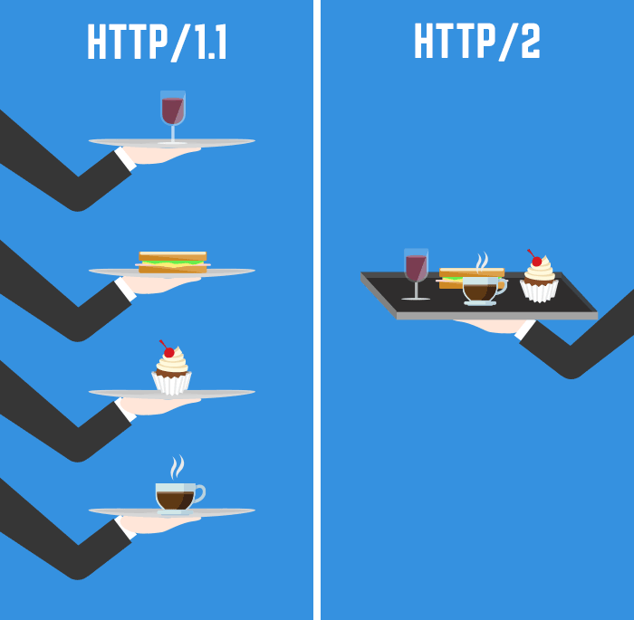
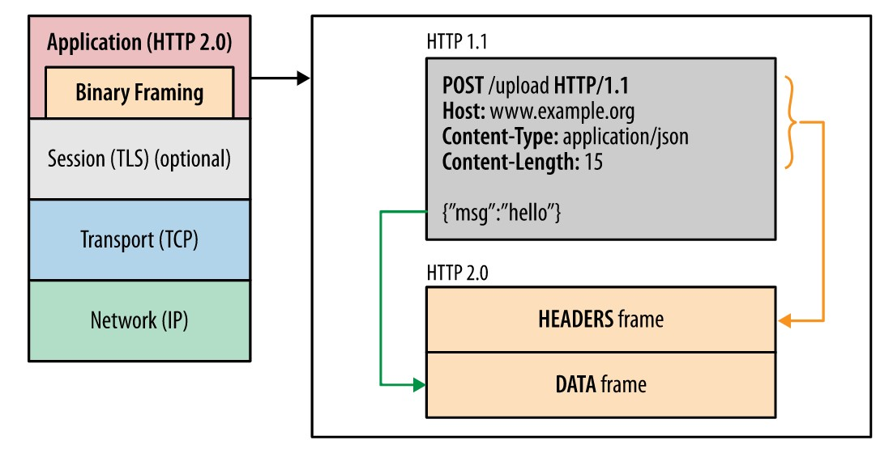

# HTTP/1.1과 HTTP/2.0, 그리고 간단한 HTTP/3.0

> http 완벽가이드 10장을 요약하는 글입니다.

---

HTTP/1.1과 HTTP/2.0의 차이를 설명하는 가장 좋은 사진이다.

---

### HTTP/2.0의 등장 배경

HTTP/1.1의 메시지 포맷은 구현의 단순성과 접근성에 주안점을 두고 최적화되었다. 그러다 보니 성능은 어느 정도 희생시키지 않을 수 없었다. 커넥션 하나를 통해 요청 하나를 보내고 그에 대해 응답 하나만을 받는 HTTP의 메시지 교환 방식은 단순했지만, 응답을 받아야만 그다음 요청을 보낼 수 있기 때문에 심각한 회전 지연(latency)을 피할 수 없었다.

때문에 더 효율적이고 빠른 HTTP가 필요했고 이러한 요구에 만들어진 것이 HTTP/2.0이다.

HTTP/2.0은 서버와 클라이언트 사이의 TCP 커넥션 위에서 동작한다. 이때 TCP 커넥션을 초기화하는 것은 클라이언트이다.

HTTP/2.0 요청과 응답은 길이가 정의된 (최대 16383 (2^14 - 1) 바이트) 한 개 이상의 프레임에 담긴다. 프레임들에 담긴 요청과 응답은 스트림을 통해 보내진다. 한 개의 스트림이 한 쌍의 요청과 응답을 처리한다. 하나의 커넥션 위에 여러 개의 스트림이 동시에 만들어질 수 있으므로, 여러 개의 요청과 응답을 처리하는 것 역시 가능하다. 

HTTP/2.0은 이들 스트림에 대한 흐름 제어와 우선순위 부여 기능도 제공한다.

HTTP/2.0은 기존의 요청-응답과는 약간 다른 새로운 상호작용 모델인 서버 푸시를 도입했다. 이를 통해 서버는 클라이언트에게 필요하다고 생각하는 리소스라면 그에 대한 요청을 명시적으로 받지 않더라도 능동적으로 클라이언트에게 보내줄 수 있다.

---

### HTTP/1.1과의 차이점

---

1. #### 프레임

HTTP/2.0에서 모든 메시지는 프레임에 담겨 전송된다. 모든 프레임은 8바이트 크기의 헤더로 시작하여, 뒤이어 최대 16383 바이트 크기의 페이로드가 온다.

출처: https://developers.google.com/web/fundamentals/performance/http2/?hl=ko

---

2. #### 스트림과 멀티플렉싱

한 쌍의 HTTP 요청과 응답은 하나의 스트림을 통해 이루어진다. 클라이언트는 새 스트림을 만들어 그를 통해 HTTP 요청을 보낸다. 요청을 받은 서버는 그 요청과 같은 스트림으로 응답을 보낸다. 그러고 나면 스트림이 닫히게 된다.

HTTP/1.1에서는 한 TCP 커넥션을 통해 요청을 보냈을 때, 그에 대한 응답이 도착하고 나서야 같은 TCP 커넥션으로 다시 요청을 보낼 수 있다. 따라서 웹브라우저들은 회전 지연을 줄이기 위해 여러 개의 TCP 커넥션을 만들어 동시에 여러 개의 요청을 보내는 방법을 사용한다. 그러나 그렇다고 TCP 커넥션을 무한정 만들 수는 없기에 한 페이지에 보내야 할 요청이 수십개에서 수백개에 달하는 오늘날에는 회전 지연이 늘어나는 것을 피하기 어렵다. 

HTTP/2.0에서는 하나의 커넥션에 여러 개의 스트림이 동시에 열릴 수 있다. 따라서 하나의 HTTP/2.0 커넥션을 통해 여러 개의 요청이 동시에 보내질 수 있기 때문에 HTTP/1.1에서의 문제는 쉽게 해결 될 수 있다. 뿐만 아니라 스트림은 우선순위를 가질 수 있다. (그러나 이 우선순위에 따르는 것은 의무사항이 아니기 때문에, 요청에 우선순위대로 처리된다는 보장은 없다.)

모든 스트림은 31비트의 무부호 정수로 된 고유한 식별자를 갖는다. 스트림이 클라이언트에 의해 초기화되었다면 이 식별자는 반드시 홀수여야 하며 서버라면 짝수여야 한다. 또한, 새로 만들어지는 스트림의 식별자는 이전에 만들어졌거나 예약된 스트림들의 식별자보다 커야 한다. 한번 사용한 스트림 식별자는 다시 사용할 수 없다. 커넥션은 오래 사용하다보면 스트림에 할당될 수 있는 식별자가 고갈되기도 하는데, 그런 경우엔 커넥션을 다시 맺으면 된다.

---

3. #### 헤더 압축

HTTP/1.1에서 헤더는 아무런 압축 없이 그대로 전송되었다. 과거에는 웹페이지 하나를 방문할 때의 요청이 많지 않았기 때문에 헤더의 크기가 큰 문제가 되지는 않았다. 하지만, 요즘 웹페이지 하나를 보기 위해서는 수십, 수백 번의 요청을 보내기 때문에 헤더의 크기가 회전 지연과 대역폭 양쪽 모두에 실질적인 영향을 끼치게 된다.

이를 개선하기 위해 HTTP/2.0에서는 HTTP 메시지의 헤더를 압축하여 전송한다. (HPACK 명세에 정의된 헤더 압축 방법으로 압축한다.)

---

4. #### 서버 푸시

HTTP/2.0은 서버가 하나의 요청에 대해 응답으로 여러 개의 리소스를 보낼 수 있도록 해준다. 이 기능은 서버가 클라이언트에서 어떤 리소스를 요구할 것인지 미리 알 수 있는 상황에서 유용하다. 

예를 들어, HTML 문서를 요청 받은 서버는 그 HTML 문서가 링크하고 있는 이미지, CSS 파일, 자바스크립트 파일 등의 리소스를 클라이언트에게 푸시할 수 있을 것이다. 이는 클라이언트가 HTML 문서를 파싱해서 필요한 리소스를 다시 요청하여 발생하게 되는 트래픽과 회전 지연을 줄여준다.

---

### 알려진 보안 이슈

- 중개자 캡슐화 공격

  > HTTP/2.0 메시지를 중간의 프락시가 HTTP/1.1 메시지로 변환할 때 메시지의 의미가 변질될 가능성이 있다. HTTP/1.1과는 달리 HTTP/2.0은 헤더 필드의 이름과 값을 바이너리로 인코딩한다. 이는 HTTP/2.0이 헤더 필드로 어떤 문자열이든 사용할 수 있게 해준다. 이는 정상적인 HTTP/2.0 요청이나 응답이 불법적이거나 위조된 HTTP/1.1 메시지로 번역되는 것을 유발할 수 있다.
  >
  > 다행히 HTTP/1.1 메시지를 HTTP/2.0 메시지로 번역하는 과정에서는 이런 문제가 발생하지 않는다.

- 긴 커넥션 유지로 인한 개인정보 누출 우려

  > HTTP/2.0은 사용자가 요청을 보낼 때의 회전 지연을 줄이기 위해 클라이언트와 서버 사이의 커넥션을 오래 유지하는 것을 염두에 두고 있다. 이것은 개인 정보의 유출에 악용될 가능성이 있다. 이는 HTTP/1.1에서도 가지고 있는 문제이기는 하나, 짧게 유지되는 커넥션에서는 상대적으로 위험이 적다.

---

## 참고문헌

HTTP 완벽 가이드(프로그래밍 인사이트)

https://developers.google.com/web/fundamentals/performance/http2/?hl=ko
