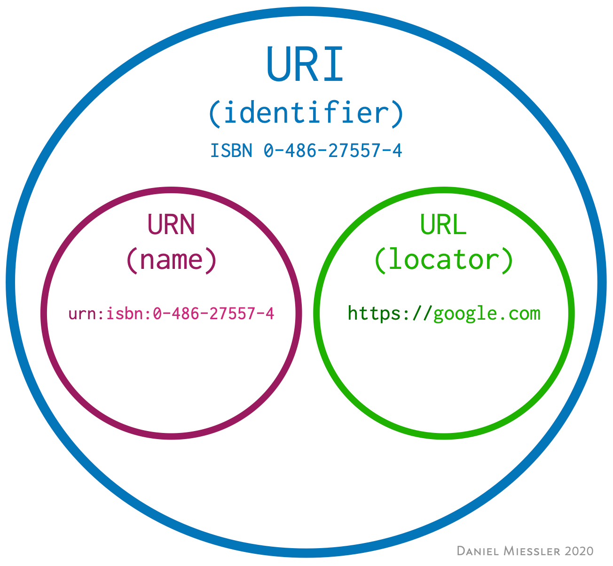

# URI vs URN vs URL

---

### URI (Uniform Resource Identifier)

인터넷 상에서 존재하는 이름 혹은 자원들을 식별하기 위한 문자열. URI를 통해 자원의 위치, 이름 등을 확인할 수 있다.

이 URI는 크게 URL과 URN으로 나뉘어질 수 있다.

---

### URL (Uniform Resource Locator) 

URL은 해당 자원을 어떻게 얻을 수 있는 지에 대해 명시한다.

요즘 우리가 사용하는 대부분의 URI 가 URL이다. 이 때문에 URI와 URL이 같다고 오해하는 경우가 많다.

---

### URN(Uniform Resource Name)

URL을 집 주소라고 한다면 URN은 사람의 이름이라고 할 수 있다. URL은 단순히 위치를 제공하는 반면에 URN은 해당 객체의 정체성을 제공한다.

예를 들면, http://tistory.com/dongkyun 에 특정 게시물이 존재한다고 가정한다. 내가 이 게시물을 지우고 다른 블로그에 해당 내용을 게시한다면  http://tistory.com/dongkyun 라는 URL로는 더이상 원래 그곳에 있던 게시물에 접근할 수 없게 된다.  반면에, 해당 게시물에 대한 URN이라면 그 게시물이 이동하더라도 이 URN은 해당 게시물 자체를 가리키기 때문에 지속적으로 접근이 가능하다.

이러한 URL의 명백한 단점으로 인해 언젠가는 URN이 URL의 자리를 대체하게 될 가능성이 높다. 하지만, 이러한 전환이 이루어지기 위해서는 충분한 시간과 준비가 필요하다. 때문에 앞으로도 URL이 지속적으로 사용되겠지만, 그 자리를 언젠가는 URN이 대체할 것이라는 사실을 기억해둘 필요가 있다.

---

### 요약

**결론적으로 요약하자면, URL과 URN은 URI의 종류이다.**

**그렇기에 모든 URL은 URI이고, 또한 모든 URN은 URI이다.**

**그리고 위에서 언급했듯이, URL과 URN은 다르다.**

**그렇다는 건 모든 URI는 URL이라고 말할 수 없다.** (URI는 URL과 같다는 주장에 대한 오류)

출처: https://mygumi.tistory.com/139 [마이구미의 HelloWorld]

---

## 참고문헌

https://mygumi.tistory.com/139

https://stackoverflow.com/questions/4913343/what-is-the-difference-between-uri-url-and-urn