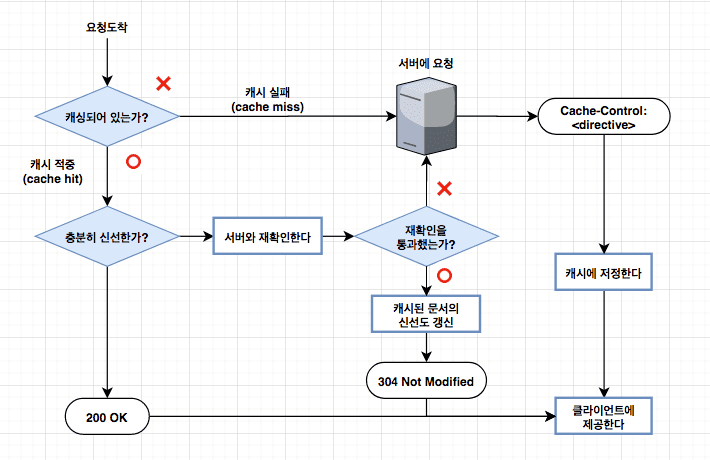

# ❓Cache

> 홈페이지가 깨졌나요? 캐시를 삭제해보세요!
>
> 캐싱으로 인해 변해야 하는 파일이 변하지 않는다면 `ctrl + r` 을 통해 하드 리프레시를 할 수도 있습니다.
>
> (ctrl + shift + r 에 위에 하나가 더 있대)
>
> 서버와 클라이언트 사이에서 응답 콘텐츠의 사본을 저장하는 공간을 캐시라 하고, 이 캐시를 유지하고 처리해주는 별도의 서버를 캐시 서버라고 한다.

---

기본적으로 캐시는 다음과 같은 혜택을 준다

- 캐시는 불필요한 데이터 전송을 줄여서, 네트워크 요금으로 인한 비용을 줄여준다.
- 캐시는 네트워크 병목을 줄여준다. 대역폭을 늘리지 않고도 페이지를 빨리 불러올 수 있게 된다.
- 캐시는 원서버에 대한 요청을 줄여준다. 서버는 부하를 줄일 수 있으며 더 빨리 응답할 수 있게 된다. 특히 갑작스럽게 요청이 쇄도하게 되는 경우에 굉장히 유용할 수 있다. (이번 코로나 백신 예약처럼)
- 페이지를 먼 곳에서 불러올 수록 시간이 많이 걸리는데, 캐시는 거리로 인한 지연을 줄여준다.

캐시는 분명한 장점을 가지긴 하지만, 항상 캐시가 가지고 있는 사본과 서버의 파일이 일치한다고 보장할 수는 없다. 때문에 때때로 캐시가 가지고 있는 사본이 여전히 최신인지 서버를 통해 점검해야 한다. 이러한 '신선도 검사'를 HTTP 재검사라고 부른다.

캐시는 스스로 원한다면 언제든지 사본을 재검사할 수 있다. 그러나 캐시가 문서를 수백만 개씩 갖고 있는 경우가 흔한데 비해 네트워크 대역폭은 부족하기 때문에, 대부분의 캐시는 클라이언트가 사본을 요청하였으며 그 사본이 검사를 할 필요가 있을 정도로 충분히 오래된 경우에만 재검사를 한다.

재검사 요청이 서버에 도달했을 때 일어날 수 있는 3가지 상황이 존재한다.

- 서버 콘텐츠가 변경되지 않은 경우 (재검사 적중)

  > 만약 서버 객체가 변경되지 않았다면, 서버는 클라이언트에게 작은 HTTP 304 Not Modified 응답을 보낸다. (응답 본문 없이)

- 재검사 부적중

  > 만약 서버 객체가 캐시된 사본과 다르다면, 서버는 콘텐츠 전체와 함께 평범한 HTTP 200 OK 응답을 클라이언트에게 보낸다.

- 객체 삭제

  > 만약 서버 객체가 삭제되었다면, 서버는 404 Not Found 응답을 돌려보내며, 캐시는 사본을 삭제한다.

---

### 적중과 부적중의 구별

이렇게 캐싱된 파일이 응답으로 바로 올 수도, 재검사 요청이 발생하여 원 서버에 한 번 접근했다가 올 수도 있다. 하지만, HTTP는 클라이언트에세 응답이 캐시 적중이었는지 아니면 원 서버에 한 번 접근했다가 온 것인지에 대한 정보를 제공하지 않는다. 두 경우 모두 응답 코드는 응답이 본문을 가지고 있음을 의미하는 200 OK가 될 것이다.

그렇다면 클라이언트측에서는 해당 파일이 캐시에서 바로 온 것인지, 원 서버에서 온 것인지 어떻게 구별할 수 있을까?

가장 간단한 방법은 응답의 Date 헤더 값을 현재 시각과 비교하는 것이다. 응답의 생성일이 더 오래되었다면 클라이언트는 응답이 캐시된 것임을 알아낼 수 있다.

---

### 캐시의 종류

웹브라우저는 개인 전용 캐시를 내장하고 있다. (보통 브라우저 캐시 혹은 로컬 캐시라고 부른다.) 대부분의 브라우저는 자주 쓰이는 문서를 개인용 컴퓨터의 디스크와 메모리에 캐시해놓고, 사용자가 캐시 사이즈와 설정을 수정할 수 있도록 허용한다.

반면 공용 캐시는 캐시 프락시 서버 혹은 더 흔히 프락시 캐시라고 불리는 특별한 종류의 공유된 프락시 서버다. 공용 캐시에는 여러 사용자들이 접근하기 떄문에 불필요한 트래픽을 줄일 수 있는 더 많은 기회가 있다. (우리가 잘 아는 웹 서버가 리버스 프록시 서버에 속한다. 이 리버스 프록시 서버에 캐시 기능을 추가해 리버스 프록시 캐시 서버로 사용하기도 하는데 이를 웹 캐시라고 한다.)

또한, transparent cache, reverse proxy cache까지 다양한 캐시들이 사용되며 이들 캐시의 기능상 차이는 많겠지만 캐시를 컨트롤하는 기본 원리는 동일하다.

| 캐시 종류          | 위치           | 이점                                                         |
| ------------------ | -------------- | ------------------------------------------------------------ |
| 브라우저 캐시      | 브라우저       | 한 번 다운로드한 리소스들을 재사용하여 사이트 로딩을 빠르게 한다. |
| 프록시 캐시        | 브라우저와 ISP | 조직 내 사용자들이 접속하는 웹 사이트의 리소스들을 캐시하여 네트워크 연결과 대역폭 사용률을 감소시키고 사용자의 웹 사이트 로딩을 빠르게 한다. |
| 트랜스패런트 캐시  | ISP            | ISP는 이 캐시를 사용하여 ISP 간 대역폭이 낭비되는 것을 막는다. |
| 리버스 프록시 캐시 | ISP와 웹 서버  | 원본 서버로 향하는 트래픽 대역폭을 감소시키고, 사용자 응답을 개선한다. |

(더 자세한 내용이 필요하다면 해당 HTTP 완벽가이드  P.194 - 200 부분을 참고하면 되겠다.)

---

### 사본을 신선하게 유지하자

캐시된 사본 모두가 서버의 문서와 항상 일치하는 것은 아니다. 때문에 캐시된 사본과 서버가 일치하게 유지할 수 있도록 만드는 메커니즘이 필요하고 이를 서버 재검사라 한다.

HTTP/1.0까지는 캐시를 제어하는 명시적인 기술이 없었다. 단지 웹 콘텐츠가 있는 원본 서버 자원들이 언제까지 유효한지 그리고 만료일 이후 해당 자원이 실제 변경되었는지 확인하는 요청/응답 헤더를 정의하고 이에 대해서만 기록한다.

HTTP/1.1부터 명시적으로 캐시를 제어할 수 있는 헤더가 추가되었고 이것이 `Cache-Control` 헤더이다.

| 헤더                   | 설명                                                         |
| ---------------------- | ------------------------------------------------------------ |
| Cache-Control: max-age | HTTP/1.1에서 콘텐츠 유지 시간을 정의하는 방식이다. max-age 값은 문서의 최대 나이를 정의한다. 최대 나이는 문서가 처음 생성된 이후부터, 제공하기엔 더 이상 신선하지 않다고 간주될 때까지 경과한 시간의 합법적인 최댓값(초 단위)이다. ex) Cache-Control: max-age=484200 |
| Expires                | HTTP/1.0은 Expire 헤더를 사용해 원본 서버 콘텐츠의 유효 기간을 지정한다. 캐시는 간단하게 Expire 날짜에서 Date 날짜를 빼는 것으로 해당 응답의 캐시 유지 시간을 결정할 수 있다. Time To Live(TTL) = Expire_value - Date_value  ex) Expires: Fri, 06 Jul 2002, 05:00:00 GMT |

Cache-Control의 값은 유효기간 - 문서가 만들어진 시간을 초단위로 계산한 것이다.

---

### Tip) Age

HTTP/1.1 스팩에서는 원본 서버에서 Cache-Control: max-age 헤더와 함께 Date 헤더 값을 통해 응답이 생성된 시간을 전달하도록 정의한다. 캐시 서버에서는 원본 서버에서 보내 준 Date 값과 응답 시간의 차이를 계산해 age라는 헤더에 담아 요청자에세 반환함으로써 해당 응답이 캐시에 얼마나 오래 머물러 있었는지 알려준다. 또한 이 age 값을 max-age 값과 비교해 캐시된 응답의 만료 여부를 판단할 수도 있다. 정확한 age를 계산하려면 원본 서버에서 캐시 서버까지의 네트워크 전송 시간 및 서버 내에서 발생하는 컴퓨팅 시간까지 모두 고려해야 하므로 계산하기가 매우 까다롭다. 때문에 많은 CDN 업체는 age를 사용하기보다는 자체적인 알고리즘을 통해 캐시 만료 여부를 판단한다.

---

**캐시된 문서가 만료되었다는 것은, 그 문서가 원 서버에 현재 존재하는 것과 실제로 다르다는 것을 의미하지는 않으며, 다만 이제 검사할 시간이 되었음을 의미한다.**

- 재검사 결과 콘텐츠가 변경되었다면, 캐시는 그 문서의 새로운 사본을 가져와 오래된 데이터 대신 저장한 뒤 클라이언트에게도 보내준다.
- 재검사 결과 콘텐츠가 변경되지 않았다면, 캐시는 새 만료일을 포함한 새 헤더들만 가져와서 캐시 안의 헤더들을 갱신한다.

---

### 캐시 최적화 방안

캐시 사용을 최대화 할 수 있는 3가지 기본 원리는 다음과 같다.

1. 최대한 많이 캐시하라
2. 최대한 오래 캐시하라
3. 최대한 가까이 캐시하라

그렇다면 캐시할 수 있는 콘텐츠와 그렇지 않은 콘텐츠는 어떻게 분류할까?

먼저 웹 사이트를 구성하는 콘텐츠는 크게 정적인 콘텐츠와 동적인 콘텐츠로 나눌 수 있다.

정적 콘텐츠는 URL을 호출할 때마다 변함없이 같은 응답을 주는 콘텐츠로 이미지, CSS, 자바스크립트 등이 대표적인 정적 콘텐츠에 속한다. 이들은 페이지를 동적이고 화려하게 만드는 중요한 역할을 하지만 호출할 때마다 소스 코드 자체가 달라지진 않기 때문에 정적 콘텐츠로 분류한다.

---

그렇다면 정적 콘텐츠의 비율은 어떻게 될까?

캐시가 가능한 정적 파일인 이미지와 오디오, 폰트, 스타일 시트 파일, 그리고 일부를 제외한 스크립트 파일들을 합치면 보통의 웹 사이트의 90% 이상이 잠재적으로 캐시할 수 있는 콘텐츠로 이루어져있다.

---

동적 콘텐츠란 사용자가 요청할 때 마다 서버에 의해 다시 생성, 응답되는 콘텐츠를 말하며 대표적인 예는 다음과 같다.

- 개인화된 콘텐츠
- API 호출이나 Ajax 요청에 대한 콘텐츠
- Beacon 전달 또는 쿠키 설정을 위한 호출

---

### 올바른 캐시 정책 설정하기

1. 먼저 캐시할 수 있는 콘텐츠인지 판단한다.

   > 일반적으로 정적 콘텐츠들을 캐시 가능한 페이지로 정의할 수 있지만 모든 정적 콘텐츠를 캐시할 수는 없다. 보안에 민감한 내용이 담겨있는 콘텐츠는 정적 페이지라도 캐시하면 안 된다. 이와 비슷하게 동적인 페이지라고 해서 모두 캐시가 불가능한 것은 아니다.
   >
   > 이처럼 캐시할 수 있거나 캐시할 수 없는 콘텐츠를 파악한 후 캐시할 수 없는 콘텐츠에는 응답 헤더에 `Cache-Control: no-store`를 붙여 캐시되지 않도록 설정한다.

2. 캐시할 수 있는 콘텐츠들은 매번 원본 서버에 변경 사항을 확인해야 하는지 판단한다.

   > 정적이지만 자주 변하는 콘텐츠들은 즉시 업데이트해줘야 한다.
   >
   > 이 경우 응답 헤더에 `Cache-Control: no-cache` 혹은 `Cache-Control: max-age=0`을 사용해 설정한다. 이때 응답할 리소스가 변경되지 않았다면 전체 리소스가 아닌 304 코드만 응답하면 되므로 네트워크 대역폭 낭비를 방지할 수 있다.

3. 캐시할 콘텐츠들의 성격을 판단한다.

   > 모든 사용자들이 공통으로 사용한다면 `Cache-Control: public`
   >
   > 개인화된 콘텐츠라면 `Cache-Control: private` 
   >
   > private을 설정할 경우 일반적인 웹 캐시 서버에서 해당 콘텐츠를 캐시할 수 없고 오직 개인 브라우저에서만 캐시한다.

4. 마지막으로 캐시 주기를 설정하고 max-age를 추가한다.

---

고객 반응에 민감한 웹 사이트 관리자들은 충분히 캐시할 수 있는 정적 리소스도 캐시하지 않으려 한다. 이런 경우 `Cache-Control: no-store`를 설정하기 보다는 `Cache-Control: no-cache, max-age=0`을 사용하는 것을 권장한다. 전자는 모든 요청에 대한 원본 서버에서 항상 전체 콘텐츠를 받는 방법이고 후자는 변경이 있을 경우만 바로 캐시에 업데이트하는 방법이다.

실제로 많은 글로벌 기업들이 캐시 주기를 매우 짧게 정해 사용하고 있다.

max-age를 0으로 설정하여 사용하는 기업이 48% 정도

---

### 캐시 오염과 캐시 충돌

원본 서버에 하나의 원본 파일만 존재하는데 캐시에 복사본이 여러 개 존재하는 것을 **캐시 오염**

요청 URL이 하나인데 브라우저 환경에 따라 서버에서 제공하는 응답이 달라져 결국 최초 요청한 브라우저의 응답만 캐시되는 것을 **캐시 충돌**

캐시 충돌의 경우 나머지 브라우저 환경을 사용하는 사용자들은 잘못된 응답을 받는다.

---

### 캐시 오염 제거

캐시 오염은 최종 사용자에게 영향을 주지는 않지만 캐시 서버의 효율성에 큰 영향을 미칠 수 있다.

때문에 이러한 캐시 오염을 피하는 방법을 확인해본다.

1. URL에 붙은 특정 쿼리 스트링 값이 달라지더라도 응답이 항상 같다면 캐시 키에서 쿼리 스트링을 무시하도록 설정. 대부분 캐시 서버에서는 특정 쿼리 스트링을 무시할 수 있는 설정이 존재한다. 해당 설정을 사용해 불필요한 쿼리 스트링을 무시한다면 리소스 낭비를 막을 수 있다.
2. 쿼리 스트링의 순서를 동일하게 정렬한다. 쿼리 스트링 순서가 달라져도 캐시는 이들을 다르게 인식한다.
3. Vary 헤더를 바르게 사용해야 한다. (220 페이지 참고)

---

### 캐시 충돌 방지

캐시 충돌은 동적 페이지를 캐시할 때 주로 발생한다. 홈페이지의 첫 화면을 예로 들면 로그인 전과 후의 페이지가 다르다. 로그인 전 페이지는 누구에게나 같게 보이지만 로그인 후에는 개인화되어 사용자마다 일부 다르게 보인다.

때문에 기본적으로 동적페이지에서는 캐시를 적용하지 않아야 한다. 앞서 언급된 예시에서도 로그인 전 홈페이지를 캐시하면 로그인이 되지 않는 문제가 발생하므로 보통 홈페이지의 첫 HTML은 캐시하지 않는다.

하지만, 여기서 큰 문제가 존재한다.

 실제로 페이지에서 동적으로 변하는 프로필 부분은 매우 작다. 해당 페이지에서도 우측 상단의 저 작은 직사각형의 부분만이 동적이고 나머지는 전부 정적이다. 그런데도 이 부분 때문에 전체 HTML 페이지를 캐시할 수 없어 페이지 로딩 속도에 영향을 미친다. 

그렇다면, 프로필 부분만 따로 떼어 별도로 수행시킨 후 캐시된 나머지 부분과 다시 조립할 수 있다면 어떨까?

해당 기능이 가능하다면 로딩 성능이 굉장히 개선될 수 있다. 이를 위해 만들어진 XML 기반 표준 마크업 언어가 [ESI](https://www.w3.org/TR/esi-lang/) 이다.                                                                                                                                                                                                                                                                                                                                                                                                                                                                                                                                                                                                                      

---

### 로컬 스토리지의 사용

HTML5 웹 스토리지의 가장 중요한 역할은 쿠키를 대체하는 것이다. 일반적으로 사용자 정보는 쿠키를 통해 저장되고 매번 네트워크를 통해 전달되어 보안에 취약하다. 또한 기존 쿠키는 도메인당 약 4KB 이내로 만들어져야 하며 50개를 초과할 수 없는 제약 또한 존재했다.

우리나라의 웹 사이트에서 사용하는 폰트 파일은 크기가 큰 편이다. 폰트 파일 역시 렌더링 프로세스를 저해하는 요소이므로 이를 로컬 스토리지에 저장하면 폰트로 인한 사이트 로딩 지연을 방지할 수 있다. 이때 API를 통해 관련 리소스가 스토리지에 있는지 먼저 확인하고 없는 경우 사이트에 동적으로 로딩시키며 리소스를 다운로드하면 URL을 키 값으로 스토리지에 저장한다.

---

### 참고문헌

- https://yngmanie.space/posts/cache
- HTTP 완벽가이드(프로그래밍 인사이트)
- 웹 성능 최적화 기법
- https://thisblogfor.me/web/http/cache/