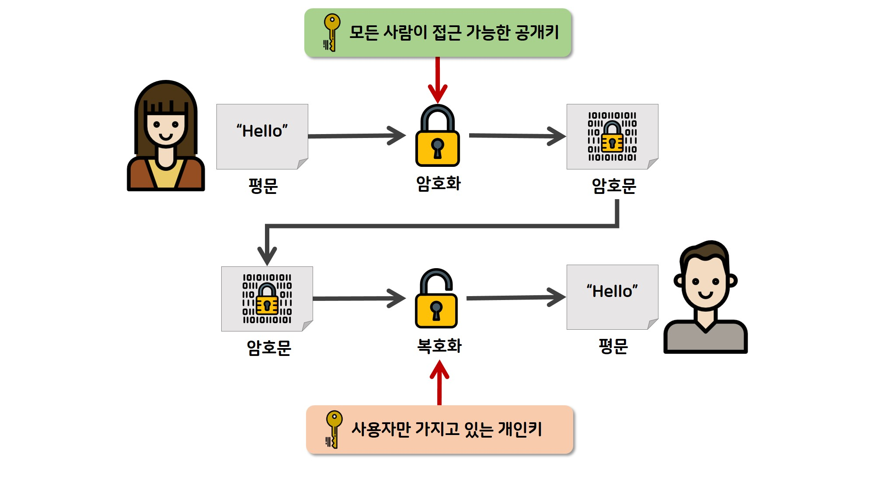
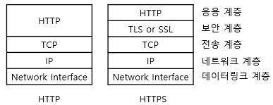

# 🎭HTTPS

> HTTP 완벽 가이드 14장을 바탕으로 작성합니다.

---

HTTPS는 기존 HTTP에 디지털 암호화 기술을 결합한 형태이다. 떄문에 HTTPS를 이해하기 위해서는 먼저 암호화 기술에 대해 간단히 알아야 한다.

---

### 대칭키 암호법

[출처: https://raonctf.com/essential/study/web/asymmetric_key]

많은 디지털 암호 알고리즘이 대칭키 암호에 해당한다. 대칭키로 불리는 이유는 인코딩을 할 때 사용하는 키가 디코딩을 할 때 사용하는 키와 같기 때문이다. 대칭키 암호에서, 발송자와 수신자 모두 통신을 위해 비밀 키 K를 똑같이 공유할 필요가 있다.

대칭키 암호에서 비밀 키가 누설되어서는 안된다. 대부분의 경우, 인코딩 및 디코딩 알고리즘은 공개적으로 알려져 있으므로, 키만이 유일한 비밀이기 때문이다.  또한, 키의 길이가 너무 짧아서도 안된다. 만약, 키의 길이가 8비트라면 256가지 값만이 가능하고, 현대 컴퓨터에서 이를 파해하는 일은 식은 죽 먹기이다. 이렇게 모든 경우를 다 시도해보는 공격은 **열거 공격(Enumeration Attack)** 이라 한다.

대칭키 암호의 단점 중 하나는 발송자와 수신자가 서로 대화하기 위해서는 둘 다 공유키를 가져야 한다는 것이다. A, B, C, D 이 4명의 사람이 서로 대화를 하고 싶어하는 상황임을 가정해본다. 이때 서로 암호화된 대화를 나누기 위해서는 총 (N-1) ^ 2 개의 키가 필요하다. (A, B, C, D 모두가 자신을 제외한 나머지 3명에 대한 공유키를 가져야 한다.) 지수승의 키가 필요하다? 이는 지옥이다.

---

### (비대칭) 공개키 암호법

[출처: https://raonctf.com/essential/study/web/symmetric_key]

대칭키 암호법의 단점 중 하나인 "많은 키가 필요하다."를 해결하기 위해 나온 암호법이다. 한 쌍의 호스트가 하나의 인코딩/디코딩 키를 사용하는 대신, 공개키 암호 방식은 두 개의 비대칭 키를 사용한다. 하나는 호스트의 메시지를 인코딩하기 위한 것이며, 다른 하나는 그 호스트의 메시지를 디코딩하기 위한 것이다. 

인코딩 키는 모두를 위해 공개되어 있다. (그래서 공개키 암호 방식이라는 이름이 붙었다.) 하지만, 호스트만이 개인 디코딩 키를 알고 있다. 모든 사람이 X에게 보내는 메시지를 같은 키로 인코딩 할 수 있지만, X를 제외한 누구도 그 메시지를 디코딩할 수 없다. 왜냐하면 오직 X만이 디코딩 개인 키를 갖고 있기 때문이다.

키의 분리는, 메시지의 인코딩은 누구나 할 수 있도록 해주는 동시에, 메시지를 디코딩하는 능력은 소유자에게만 부여한다. 이는 노드가 서버로 안전하게 메시지를 발송하는 것을 더 쉽게 해주는데, 왜냐하면 서버의 공개 키만 있으면 되기 때문이다.

---

### RSA

- 공개키(물론 공개니까 누구나 얻을 수 있다.)
- 가로채서 얻은 암호문의 일부(네크워크 스누핑을 통해)
- 원본 메시지와 그것을 암호화한 암호문(인코더가 공개되어 있으니까 해당 인코더에 돌려서 만든다.)

만약 악당이 위와 같은 내용들을 알고 있다 해도 비밀인 개인 키가 계산될 수 없음을 보장할 수 있을까?

이 요구를 만족하는 공개키 암호 체계 중 유명한 하나는 RSA 알고리즘이다. 위의 내용들을 알고 있다 하더라도 개인 키를 찾아내는 것은 난제 중 하나인 큰 소수를 계산하는 문제만큼 어렵다고 한다. (만약 큰 숫자를 소수들로 분해하는 빠른 방법을 찾는다면 난제 해결은 물론 튜링상까지 바로 받을 수 있을 것이다. 실제로 RSA 알고리즘을 만든 세 명의 수학자들은 2002년에 튜링상을 수상했다.)

RSA 암호 방식 자체를 이해하는 것 또한 굉장히 어렵다. 

https://ko.wikipedia.org/wiki/RSA_%EC%95%94%ED%98%B8

링크를 남겨두었으니 필요하다면 읽어보면 될 것이다. 세상에는 정수론을 알지 못하더라도 RSA 알고리즘을 사용할 수 있게 해주는 라이브러리들이 충분히 많이 존재한다.

---

### 그렇다면 실제로는 대칭키 방식이 쓰일까? 아니면 공개키 방식이 쓰일까?

공개키 방식은 필요한 키의 개수를 줄여주기는 하나 계산이 느린 단점이 존재한다. 때문에 실제로는 대칭과 비대칭 방식을 섞은 것을 사용한다. 예를 들어, 노드들 사이의 안전한 의사소통 채널을 수립할 때는 편리하게 공개 키 암호를 사용하고, 이렇게 만들어진 안전한 채널을 통해 임시의 무작위 대칭키를 생성하고 교환하여 이후의 나머지 데이터를 암호화할 때는 빠른 대칭 키를 사용하는 방식이 쓰인다.

---

### 서버 인증을 위해 인증서 사용하기

사용자가 HTTPS를 통한 안전한 웹 트랜잭션을 시작할 때, 최신 브라우저는 자동으로 접속한 서버에서 디지털 인증서를 가져온다. 만약 서버가 인증서를 가지고 있지 않다면, 보안 커넥션은 실패한다. 서버 인증서는 다음을 포함한 많은 필드를 갖고 있다.

- 웹 사이트의 이름과 호스트명
- 웹 사이트의 공개키
- 서명 기관의 이름
- 서명 시관의 서명

브라우저가 인증서를 받으면, 서명 기관을 검사한다. 만약 그 기관이 공공이 신뢰할만한 서명 기관이라면 브라우저는 그것의 공개키를 이미 알고 있을 것이다. (브라우저들은 여러 서명 기관의 인증서가 미리 설치된 채로 출하된다.)

만약 서명 기관이 모르는 곳이라면 브라우저는 그 서명 기관을 신뢰해야 할지 확실할 수 없게 된다. 때문에 이 경우 서명 기관을 신뢰하는지 확인하기 위한 대화상자를 보여준다. 

---

### 이제부터 HTTPS의 세부사항에 대해 알아본다.

​                                                         [출처: http://www.ktword.co.kr/abbr_view.php?m_temp1=3132]

HTTPS는 HTTP 메시지를 TCP로 보내기 전에 먼저 그것들을 암호화하는 보안 계층으로 보낸다.

HTTPS에서는 https라는 스킴을 사용하며, 80번 포트를 사용하는 http와는 달리 443번 포트를 사용한다.

HTTPS에서는 `3-way-handshake` TCP 연결을 진행한 이후에 `4-way-TLS-handshake`가 수행된다.

(1) 클라이언트가 암호 후보들을 보내고 인증서를 요구한다.

(2) 서버는 선택된 암호와 인증서를 보낸다.

(3) 클라이언트가 비밀정보를 보낸다. 클라이언트와 서버는 키를 만든다. (대칭키 방식(이전까지는 비대칭키 방식으로 소통한다.))

(4) 클라이언트와 서버는 서로에게 암호화를 시작한다고 말해준다.

---

### 사이트 인증서 검사

TLS handshake 3번째 단계에서 클라이언트는 인증서를 받게 된다. 최신 웹브라우저들 대부분은 인증서에 대해 간단하게 기본적인 검사를 하고 그 결과를 더 철저한 검사를 할 수 있는 방법과 함께 사용자에게 알려준다. 이 인증서 검사를 위한 알고리즘 수행 단계는 다음과 같다.

- 날짜 검사

  > 인증서가 아직 유효한지 확인한다.

- 서명자 신뢰도 검사

  > 모든 인증서는 서버를 보증하는 어떤 인증 기관(Certificate Authority, CA)에 의해 서명되어 있다. 누구나 인증서를 생성할 수 있지만, 몇몇 CA는 인증서 지원자의 신원 및 사업의 선량함을 입증하는 알기 쉬운 절차를 갖춘, 잘 알려진 기관이다. 이 때문에 브라우저는 신뢰할 만한 서명 기관의 목록을 포함한 채로 배포된다. 만약 브라우저가 알려져 있지 않은 인증기관으로부터 서명된 인증서를 받았다면, 브라우저는 보통 alert창을 띄운다. 

- 서명 검사

  > 한번 서명 기관이 믿을만하다고 판단하면, 브라우저는 서명기관의 공개키를 서명에 적용하여 그의 체크섬과 비교해봄으로써 인증서의 무결성을 검사한다.

- 사이트 신원 검사

  > 도메인의 주소가 같은지 확인한다.

---

### 그렇다면 이러한 의문이 들 수 있다. https는 http에서는 없던 4-way-handshake가 추가되었으니까 더 느리겠네??

정답은 그렇지 않다이다. https는 http보다 빠르다. 그 이유는 HTTP/2와 관련이 있다.

HTTP/2의 표준에서 TLS를 요구하지는 않는다. 하지만 SPDY에서 TLS를 요구했던 여파로 인해 모든 메이저 브라우저들이 TLS 없이는 HTTP/2를 지원하지 않고 있다. (TLS가 없으면 무조건 HTTP/1.1로 요청한다.) HTTP/2는 한번에 여러 파일을 보낼 수 있기 때문에 빠르다.

---

또한, https는 SEO에서도 장점을 가진다. 구글 개발자 문서를 보게 되면 https에 SEO에 대해서 더 높은 점수를 주고 있음을 명시하고 있다.

---

## 참고문헌

https://gobooki.net/%EC%84%B8%EB%AF%B8%EB%82%98-%EC%9A%94%EC%95%BD-https%EB%9E%80-%EB%AC%B4%EC%97%87%EC%9D%B8%EA%B0%80/

https://namu.wiki/w/HTTP/2

HTTP 완벽 가이드(인사이트)
