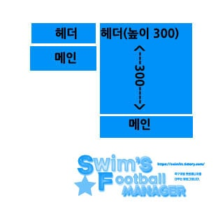
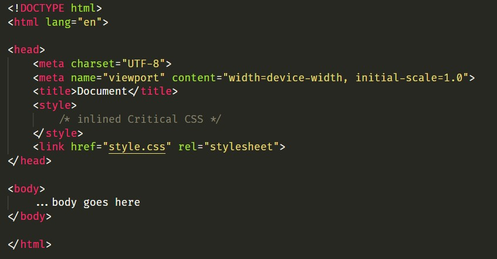

# 👀Critical Rendering Path

> *성능을 최적하려면 HTML, CSS 및 자바스크립트 바이트를 수신한 후 렌더링된 픽셀로 변환하기 위해 필요한 처리까지, 그 사이에 포함된 중간 단계에서 어떠한 일이 일어나는지를 파악하기만 하면 됩니다. 이러한 단계가 바로 Critical Rendering Path(주요 렌더링 경로)입니다.*
>
> 이 문서의 모든 내용은 기본적으로 구글의 개발자 문서를 바탕으로 작성합니다. 이해하기 어려운 부분들은 다른 블로그들의 친절한 설명들을 인용할 예정이며 모두 출처를 밝히고 사용하겠습니다. 
>
>  https://developers.google.com/web/fundamentals/performance/critical-rendering-path

---

먼저, Critical Rendering Path는 크게 다섯개의 단계로 구분할 수 있다.

1. HTML 마크업을 처리하고 DOM 트리를 빌드한다.
2. CSS 마크업을 처리하고 CSSOM 트리를 빌드한다.
3. DOM 및 CSSOM을 결합하여 렌더링 트리를 형성한다.
4. 렌더링 트리에서 레이아웃을 실행하여 각 노드의 기하학적 형태를 계산한다.
5. 개별 노드를 화면에 페인트 한다.

주요 렌더링 경로를 최적화하는 작업은 위의 1~5단계를 수행할 때 필요한 총 시간을 최소화시키는 프로세스이다.

---

## 1. HTML 마크업을 처리하고 DOM 트리를 빌드한다.

>  기본적으로 HTML 마크업을 처리한 결과인 DOM과, CSS 마크업을 처리한 결과인 CSSOM은 서로 독립적인 데이터 구조라는 사실을 명심해야 한다.

http 혹은 https 통신을 통해 우리는 바이트 형태의 HTML 파일을 가져오게 된다. 이후 이 바이트를 문자로, 문자를 토큰으로, 토큰을 노드로, 노드를 객체 모델로 전환하는 작업을 수행해야 한다, (**바이트 → 문자 → 토큰 → 노드 → 객체 모델**)

이 과정을 조금 더 쉽게 설명하기 위해 구글 개발자 문서의 코드와 그림을 사용한다.

```html
<!DOCTYPE html>
<html>
  <head>
    <meta name="viewport" content="width=device-width,initial-scale=1">
    <link href="style.css" rel="stylesheet">
  </head>
  <body>
    <p>Hello <span>web performance</span> students!</p>
    <div></div>
  </body>
</html> 
```


1. 변환: 브라우저가 HTML의 원시 바이트를 디스크나 네트워크에서 읽어와서, 해당 파일에 대해 지정된 인코딩(ex. UTF-8)에 따라 개별 문자로 변환한다.

2. 토큰화

   >
   >
   >토큰화 과정을 잘 보여주는 그림이다.
>
   >초기 상태는 "자료" 이다. `<` 문자를 만나면 상태는 "태그열림" 으로 변한다. 이후 a부터 z까지의 문자를 만나면 "태그이름" 상태로 변하게 되고 이 상태는 `>` 문자를 만날 때까지 유지한다. 
   >
   >`>` 문자에 도달하면 현재 토큰이 발행되고 상태는 다시 "자료" 로 돌아간다. 이후 다시 문자들을 소비하면서 문자 토큰이 생성되고 발행될 것이다. 이 과정은 종료 태그의 `<` 문자를 만날 때까지 진행된다.
   >
   >`<` 문자에 도달하면 다시 "태그열림" 상태가 된다. `/` 문자는 종료 태그 토큰을 생성하고 "태그이름" 상태로 변경된다. 이 상태는 `>` 문자를 만날 때까지 유지된다. 
   >
   >`>` 문자를 만나게 되면 다시 새로운 토큰이 발행되고 "자료" 상태가 된다. 
   >
   >이후 과정은 반복이다.

3. 렉싱: 방출된 토큰은 해당 속성 및 규칙을 정의하는 '객체'로 변환된다.
   
4. DOM 생성: 마지막으로, HTML마크업이 여러 태그 간의 관계를 정의하기 때문에 생성된 객체는 트리 데이터 구조 내에 연결된다. 이 트리 데이터 구조에는 원래 마크업에 정의된 상위-하위 관계도 포함된다. 즉, `HTML` 객체는 `body` 객체의 상위이고, `body`는 `paragraph `객체의 상위인 식이다.


**이 전체 프로세스의 최종 출력이 해당 페이지의 DOM이며, 브라우저는 이후 모든 페이지 처리에 이 DOM을 사용한다.**

---

## 2. CSS 마크업을 처리하고 CSSOM 트리를 빌드한다.

```html
<!DOCTYPE html>
<html>
  <head>
    <meta name="viewport" content="width=device-width,initial-scale=1">
    <link href="style.css" rel="stylesheet">
  </head>
  <body>
    <p>Hello <span>web performance</span> students!</p>
    <div></div>
  </body>
</html> 
```

위에서 사용한 HTML 파일을 다시본다. 코드의 흐름은 위에서 아래이다. html 태그를 거치고, head 태그를 거쳐서, meta에 대한 내용을 확인하고, 그 이후에 외부 CSS 스타일시트인 style.css를 참조하는 코드를 만나게 된다. 이때, 브라우저는 페이지를 렌더링하는데 이 리소스가 필요할 것이라 판단하게 된다. 때문에 HTML 파일에 대한 DOM 구성을 잠시 멈추고 CSSOM을 구성하기 시작한다. 

바로 이 순간을 `Render-Blocking CSS`라고 부른다. 이 `Render-Blocking CSS`는 렌더링하는데 필요한 시간을 길게 만든다. 때문에 이 부분에 대한 최적화가 필요하고 이 문서의 마지막 부분쯤에서 다룰 예정이다.

HTML과 마찬가지로, 수신된 CSS 규칙을 브라우저가 이해하고 처리할 수 있는 형식으로 변환해야 한다. 따라서 HTML 대신 CSS에 대해 HTML에서 했던 프로세스를 반복한다.

```css
body { font-size: 16px }
p { font-weight: bold }
span { color: red }
p span { display: none }
img { float: right } 
```

만일 `style.css`의 내용이 위와 같다면, 아래와 같은 CSS Object Model(CSSOM)이 만들어진다.


   CSSOM이 트리 구조를 가지는 이유는 무엇일까? 페이지에 있는 객체의 최종 스타일을 계산할 때 브라우저는 해당 노드에 적용 가능한 가장 일반적인 규칙( ex. body 요소의 하위에 존재하는 모든 요소에 body 요소의 스타일을 적용)으로 시작한 후 더욱 구체적인 규칙을 적용하는 방식으로, 즉 '하향식'으로 규칙을 적용하는 방식으로 계산된 스타일을 재귀적으로 세분화한다.

위의 코드와 그림을 통해 어떤 식으로 스타일이 적용되는지 쉽게 이해할 수 있다.

---

## 3. DOM 및 CSSOM을 결합하여 렌더링 트리를 형성한다.


DOM과 CSSOM은 각기 다른 측면을 캡처하는 서로 독립적인 객체이다. 하나는 콘텐츠를 설명하고, 다른 하나는 문서에 적용되어야 하는 스타일 규칙을 설명한다. 브라우저는 이 둘을 결합하여 렌더링 트리를 만든다.

여기서 제일 중요한 것은 렌더링 트리에는 페이지를 렌더링하는데 필요한 노드만이 포함된다는 것이다. 보다 더 쉬운 이해를 위해 그림을 살펴보자.


1. 가장 먼저 DOM 트리의 루트(위의 그림에서는 `html`)에서 시작하여 표시되는 노드 각각을 순회한다. 하지만, 순회하는 모든 노드들이 렌더링 트리에 포함되는 것은 아니다. 렌더링하는데 필요하지 않은 `meta`, `script`와 같은 태그들은 그냥 지나간다. (일부 노드는 CSS를 통해 숨겨지며, 렌더링 트리에서도 생략되는 경우가 있다. 예를 들어 `display: none`과 같은 CSS 속성이 적용돼 있다면 렌더링 트리에서 누락된다.)
2. 표시된 각 노드에 대해 적절하게 일치하는 CSSOM 규칙을 찾아 적용한다.
3. 표시된 노드를 콘텐츠 및 계산된 스타일과 함께 내보낸다.

최종 출력은 화면에 표시되는 모든 노드의 콘텐츠 및 스타일 정보를 모두 포함하는 렌더링 트리이다. 렌더링 트리가 생성되었으므로 '레이아웃' 단계로 진행할 수 있다.

---

## 4. 렌더링 트리에서 레이아웃을 실행하여 각 노드의 기하학적 형태를 계산한다.

이 레이아웃 단계에서, 기기의 뷰포트 내에서 렌더링 트리의 노드들에 대한 위치와 크기가 계산된다. 이 단계를 경우에 따라 '리플로우' 라고 부르기도 한다. 

페이지에서 각 객체의 정확한 위치와 크기를 계산하기 위해 브라우저는 렌더링 트리를 루트에서부터 순회하기 시작한다. 

뷰포트 내에서 각 요소의 정확한 위치와 크기를 정확하게 캡처하는 '상자 모델'이 출력되고, 모든 상대적인 측정값은 화면에서 절대적인 픽셀로 변환된다. 

구글에서 제공한 간단한 예제를 통해 좀 더 쉽게 이해해보자.

```html
<!DOCTYPE html>
<html>
  <head>
    <meta name="viewport" content="width=device-width,initial-scale=1">
    <title>Critial Path: Hello world!</title>
  </head>
  <body>
    <div style="width: 50%">
      <div style="width: 50%">Hello world!</div>
    </div>
  </body>
</html>
```


위 페이지의 본문에는 두 가지 중첩된 div가 포함되어 있다. 첫 번째(상위) div는 노드의 표시 크기를 뷰포트 너비의 50%로 설정하며,---상위 div에 포함된---두 번째 div는 해당 너비를 상위 항목 너비의 50%(즉, 뷰포트 너비의 25%)로 설정한다.

---

## 5. 개별 노드를 화면에 페인트 한다.

지금까지 계산한 스타일 및 기하학적 형태를 바탕으로, 렌더링 트리의 각 노드를 화면의 실제 픽셀로 변환한다. 이 단계를 흔히 '페인팅' 또는 '래스터화' 라고 한다.

---

### 결국 Critical Rendering Path는 크게 5개의 흐름으로 구성된다.  하지만, 렌더링하는데 필요한 시간을 줄이기 위해 서는 특정 단계에서의 최적화가 필요하다. 지금부터 최적화에 대한 내용을 알아보겠다.

---

## Reflow, Repaint 줄이기

> 이 부분의 내용은  https://boxfoxs.tistory.com/408 이 블로그의 내용 중 하단 부분을 거의 베끼다시피 한 글입니다. 정말 좋은 글을 써주신 해당 블로그의 주인분께 진심으로 감사드립니다.

### Reflow

위에서 언급된 렌더링 과정을 거친 뒤에 최종적으로 페이지가 그려진다고 해서 렌더링 과정이 다 끝나는 것은 아니다. 어떠한 액션이나 이벤트에 따라 html 요소의 크기나 위치등 레이아웃 수치를 수정하면 그에 영향을 받는 자식 노드나 부모 노드들을 포함하여 레이아웃 과정을 다시 수행하게 된다. 이렇게 되면 렌더링 트리와 각 요소들의 크기와 위치를 다시 계산하게 된다. 이러한 과정을 Reflow 라고 한다.

```javascript
// Reflow 발생 예제
function reflow(){
	document.getElementById('content').style.width = '600px';
}
```

Reflow가 일어나는 대표적인 경우는 다음과 같다.

- 페이지 초기 렌더링 시(최초 layout 과정)
- 윈도우 리사이징 시(Viewport 크기 변경 시)
- 노드 추가 또는 삭제 
- 요소의 위치, 크기가 변경되는 경우(left, top, margin, padding, border, width, height 등)
- 폰트 변경 혹은 이미지 크기 변경 시

<br/>

### Repaint

Reflow만 수행되면 실제 화면에 반영되지 않는다. 위에서 언급된 렌더링 과정과 같이 렌더링 트리를 다시 화면에 그려주는 과정이 필요하다. 결국은 Paint 단계가 다시 수행되는 것이며 이를 Repaint 라고 한다.

하지만, 무조건 Reflow가 있어야만 Repaint가 발생하는 것은 아니다. background-color, visibility와 같이 레이아웃에는 영향을 주지 않는 스타일 속성이 변경 되었을 때는 Reflow를 수행할 필요가 없기 때문에 Repaint만 수행하게 된다.

<br/>

### Reflow, Repaint 줄이기!

결국 Reflow와 Repaint를 줄이는 것이 성능을 최적화시키는데에 중요하다. 이 두 개를 줄이는 방법을 소개한다.

1. 사용하지 않는 노드에는 `visibility: invisible` 보다 `display: none`을 사용하기

   > visibility invisible은 레이아웃 공간을 차지하기 때문에 Reflow의 대상이 된다. 하지만, `display: none`은 Layout 공간을 차지하지 않아 렌더 트리에서 아예 제외된다.

2. Reflow, Repaint가 발생하는 속성 사용 피하기

   > 아래는 각각 Reflow, Repaint가 일어나는 CSS 속성들이다. Reflow가 일어나면 Repaint는 필연적으로 일어나야 하기 때문에 가능하다면 Reflow가 발생하는 속성보다는 Repaint만 발생하는 속성을 사용하는 것이 좋다.
   >
   > <br/>
   >
   > <Reflow가 일어나는 대표적인 속성>
   >
   > |     position     |       width        |     height      |      left      |       top       |
   > | :--------------: | :----------------: | :-------------: | :------------: | :-------------: |
   > |    **right**     |     **bottom**     |   **margin**    |  **padding**   |   **border**    |
   > | **border-width** |     **clear**      |   **display**   |   **float**    | **font-family** |
   > |  **font-size**   |  **font-weight**   | **line-height** | **min-height** |  **overflow**   |
   > |  **text-align**  | **vertical-align** | **white-space** |                |                 |
   >
   > <br/>
   >
   > <Repaint가 일어나는 대표적인 속성>
   >
   > |    background     | background-image  | background-position | background-repeat |   background-size   |
   > | :---------------: | :---------------: | :-----------------: | :---------------: | :-----------------: |
   > | **border-radius** | **border-style**  |   **box-shadow**    |     **color**     |   **line-style**    |
   > |    **outline**    | **outline-color** |  **outline-style**  | **outline-width** | **text-decoration** |
   > |  **visibility**   |                   |                     |                   |                     |

3. 영향을 주는 노드 줄이기

   >JavaScript + CSS를 조합하여 애니메이션이 많거나 레이아웃 변화가 많은 요소의 경우 position을 absolute 또는 fixed를 사용하여 영향을 받는 주변 노드들을 줄일 수 있습니다. fixed와 같이 영향을 받는 노드가 전혀 없는 경우 Reflow과정이 전혀 필요가 없어지기 때문에 Repaint 연산비용만 들게 됩니다.
   >
   > 
   >
   >또다른 방법은 애니메이션 시작시 요소를 absolute, fixed로 변경 후 애니메이션이 종료되었을 때 원상복구 하는 방법도 Reflow, Repaint 연산을 줄이는대에 도움이 됩니다.

4. 프레임 줄이기

   >단순히 생각하면 0.1초에 1px씩 이동하는 요소보다 3px씩 이동하는 요소가 Reflow, Repaint 연산비용이 3배가 줄어든다고 볼 수 있습니다. 따라서 부드러운 효과를 조금 줄여 성능을 개선할 수 있습니다.

---

## CSS에서 렌더링 차단 리소스 제거 하기

일단 기본적으로 HTML 및 CSS는 둘 다 렌더링 차단 리소스이다. 하지만, 이 둘이 조금 다른 점이 있다면 HTML의 경우 DOM이 없으면 렌더링할 것이 없기 때문에 명확하지만, CSS의 요구사항은 다소 불명확할 수 있다.

다시 말하지만, 기본적으로 CSS는 렌더링 차단 리소스이다. 때문에 최초 렌더링에 걸리는 시간을 줄이려면 클라이언트에 CSS 파일이 최대한 빠르게 다운로드되어야 하고 이를 위해 최초 렌더링에 필요한 CSS 속성과 그렇지 않은 CSS 속성들을 구분할 필요가 있다.


다음 사진의 경우를 보자. 이 사진에서 Critical로 표시된 부분은 첫 화면 렌더링시에 표시되는 부분이고, Non-Critical로 표시된 부분은 스크롤을 내려야만 볼 수 있는 부분이다. 첫 렌더링 시에 표시되지 않는 Non-Critical 부분의 CSS 속성들을 미리 다운로드할 필요가 있을까? 그럴 필요는 절대 없다. 때문에 첫 렌더링 시에 표시되는 CSS 속성들만을 빠르게 받아와서 화면을 그리고, 나머지 CSS 속성들은 비동기적으로 천천히  받아와 사용자 환경을 개선해주는 것이 훨씬 더 중요하다.



[출처](https://swimfm.tistory.com/entry/PageSpeed-Insights%EC%9D%98-%EB%A0%8C%EB%8D%94%EB%A7%81-%EC%B0%A8%EB%8B%A8-%EB%A6%AC%EC%86%8C%EC%8A%A4%EB%A5%BC-%EC%A0%9C%EA%B1%B0%ED%95%B4%EB%B3%B4%EC%9E%90)

또 다른 사진을 보자. 만약 CSS가 비동기적으로 로딩된다면 헤더와 메인의 자리가 정해진 후, CSS로 높이가 300이 주어지면서 헤더가 밑으로 팽창할 것이다. 그러면 메인은 당연히 밑으로 밀려나고, Reflow, Repaint가 일어나서 성능누수가 심하게 일어난다. 따라서 이런 CSS 요소들은 HTML을 그리던 것을 멈추고, 처음부터 적용시키는 것이 훨씬 효율적이다. 

이러한 경우들을 위해서 만들어진 개념이 **Critical CSS**이다.

Critical CSS의 핵심은 CSS 파일을 두 개로 쪼개는 것이다. 바로 Critical CSS와 Non-Critical CSS이다. 

첫 렌더링시 화면에 보여지는 부분들에 대한 CSS 속성 혹은 미리 그려지지 않는다면 Reflow, Repaint를 유발하게 되는 CSS 속성들을 Critical CSS로, 그렇지 않은 CSS 속성들은 Non-Critical CSS로 구분하는 것이다.

그렇다면 이 두 파일은 어느 곳에 위치하게 될까?

바로, Critical CSS는 HTML의 `<head>` 태그 속 `<style>` 태그 사이에, Non-Critical CSS는 스타일시트 파일을 불러오는 식으로 코드를 작성하면 된다.



그렇다면, 우리가 기존에 스타일시트 파일을 불러오기 위해 사용하던 `<link href="style.css" rel="stylesheet">` 이런 식의 코드를 사용하면 되는걸까?

**아니다. 다시 한번 강조하지만 우리가 Critical CSS와 Non-Critical CSS를 구분하는 가장 큰 이유는 결국 Critical CSS는 동기적으로, Non-Critical CSS는 비동기적으로 가져오기 위함에 있다. 그런면에서 **`<link href="style.css" rel="stylesheet">` **와 같은 코드 작성은 피해야한다. 이런 식의 코드는 HTML 렌더링을 차단하고 CSS 렌더링을 수행하게 한다. 즉, 동기적인 수행을 일으킨다. 때문에 우리는 다른 방법으로 스크립트 파일을 불러와야하고 바로 다음 주제에서 이를 다루겠다. **

---

## 비동기적으로 CSS 파일 불러오기

```html
<link href="style.css"    rel="stylesheet">
<link href="style.css"    rel="stylesheet" media="all">
```

먼저, 이 두 가지의 방법은 HTML 렌더링을 차단하고 CSS 렌더링을 수행시킨다. 즉, 동기적인 과정이 이루어진다. 이미 우리는 Critical한 CSS와 Non-Critical한 CSS를 구분해놨다. 그럼에도 불구하고 Non-Critical한 CSS 속성들만 모여있는, 다시 말해 첫 렌더링시에 사용하지 않는 속성들만이 모여있는 `style.css` 파일을 동기적으로 가져오는 것은 굉장한 비효율이다.  

때문에 우리는 이 파일들을 비동기적으로 가져오는 방법을 알아야 할 필요가 있다.

가장 간단한 방법이자 추천하는 방법은 아래의 코드이다.

```html
<link rel="stylesheet" href="style.css" media="print" onload="this.media='all'">
```

물론, 자바스크립트로 CSS 파일을 fetch하는 방법이나, `rel=preload`를 사용하는 방법도 존재한다.

```html
<script> loadCSS('style.css')</script>

<link rel="preload" href="style.css" as="style">
```

위의 3가지 방법 모두 내부적으로 동일한 메커니즘에 의해 수행된다. 그럼에도 불구하고 첫번째 방법을 추천하는 이유는 "간단"하기 때문이다.(솔직히 간단한게 맞나? 싶다. 내 생각에는 맨 마지막 코드가 직관적이고 더 간단한 것 같은데 [참조한 문서](https://www.filamentgroup.com/lab/load-css-simpler/)에서 그렇다고 한다.)

---

## ✨마무리

이렇게 Critical Rendering Path에 대한 설명을 마친다. 하지만, Critical Rendering Path가 끝났다고해서 모든 것이 끝나는게 아니다. 

Reflow를 설명할 때 *어떠한 액션이나 이벤트에 따라 html 요소의 크기나 위치등 레이아웃 수치를 수정* 이라는 문장을 사용하였다. 이 문장에서 말하는 어떠한 액션이나 이벤트는 결국 **자바스크립트**에 의한 동작을 의미한다. 때문에 우리는 자바스크립트가 어떤 특징을 가지고 어떻게 DOM을 건들이는지에 대해 이해할 필요가 있다. (이에 대한 글도 바로 쓰기 시작할거다.)

솔직히 HTML과 CSS에 대해서 잘 모르고 잘 다루지도 못한다. 때문에 글을 쓰면서 "아... 잘 알지도 못하는데 이렇게 깊은 내용을 공부하고 기록으로 남기는게 맞는걸까?"라는 회의감에 몇 번이나 휩싸였다. 그럼에도 불구하고 끝까지 작성한 이유는 작동방식에 대한 이해는 기본 중에 기본이라고 생각하기 때문이다. 프로그래밍을 공부하면서 많이 느끼지만 기본이 되지 않은 상태에서 공부해봐야 일주일이 지나면 까먹는다. 물론, 매일 반복해서 까먹지 않게 만들 수도 있다. 하지만, 그것은 이해하려는 노력이 아니라 익숙해지려는 노력일 뿐이다. 

프로그래밍 분야는 빠르게 변화한다. 특히 내가 좋아하는 프론트 분야가 그러하다. 프론트 분야에서 익숙해지기 위한 노력은 자기 자신에 대한 유통기한을 만들 뿐이다. 유통기한이 없는 프론트 개발자가 되기 위해서 끊임없이 기본을 이해하려는 노력들을 수행해야 한다.  

시간이 오래 걸리더라도 기본에 충실한 개발자가 되려는 노력을 하고 싶다. 하지만, 간간이 내 자신의 조급함이 이런 내 꿈의 발목을 잡는 것 같은 느낌을 많이 받는다. 솔직히 프로그래밍을 배우기 이전에 내 자신을 컨트롤하는 법부터 배워야할 듯 싶다.

---

## 참고문헌

   https://developers.google.com/web/fundamentals/performance/critical-rendering-path/render-tree-construction?hl=ko

https://boxfoxs.tistory.com/408

https://www.notion.so/Critical-Rendering-Path-1-f497d63b474e4c5aab03c92a83e3e652

https://d2.naver.com/helloworld/59361

https://seolhun.github.io/contents/web-%EC%9B%B9%EC%82%AC%EC%9D%B4%ED%8A%B8%EC%9D%98-%EC%86%8D%EB%8F%84%EB%A5%BC-%EA%B0%9C%EC%84%A0%ED%95%A0-%EC%88%98-%EC%9E%88%EB%8A%94-%EB%B0%A9%EB%B2%95-9-%EA%B0%80%EC%A7%80-%EC%A0%95%EB%A6%AC-part-2

https://swimfm.tistory.com/entry/PageSpeed-Insights%EC%9D%98-%EB%A0%8C%EB%8D%94%EB%A7%81-%EC%B0%A8%EB%8B%A8-%EB%A6%AC%EC%86%8C%EC%8A%A4%EB%A5%BC-%EC%A0%9C%EA%B1%B0%ED%95%B4%EB%B3%B4%EC%9E%90

https://www.smashingmagazine.com/2015/08/understanding-critical-css/

https://www.filamentgroup.com/lab/load-css-simpler/

모두 다 정말 좋은 글이다. 시간이 급한게 아니라면 하나씩 읽어볼 가치가 충분하다.