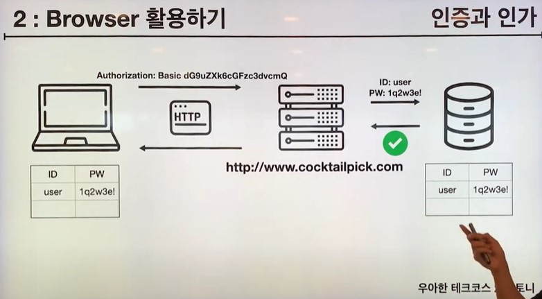
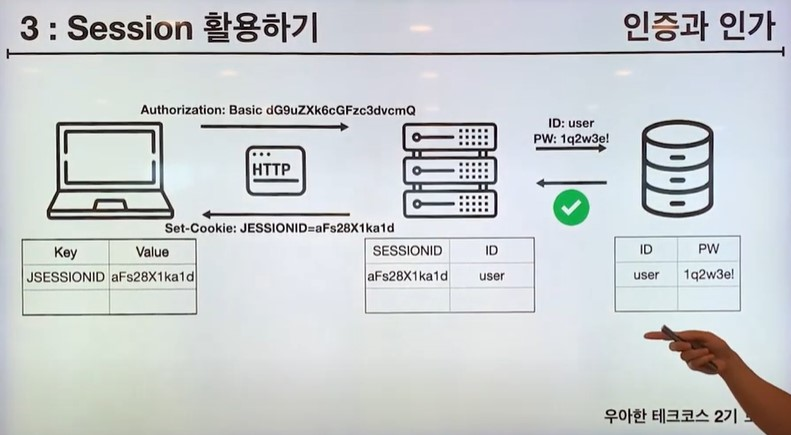
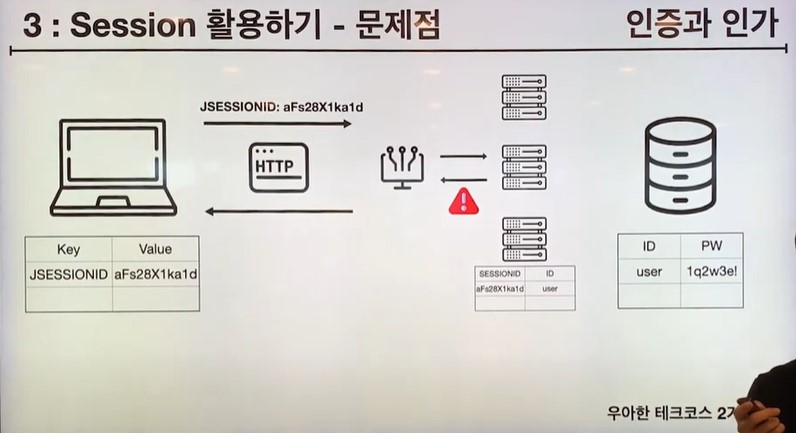
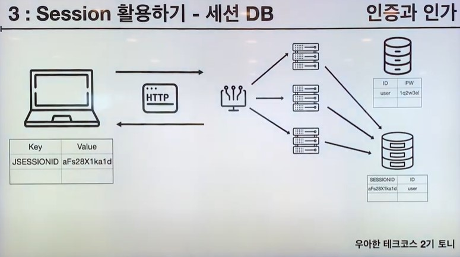
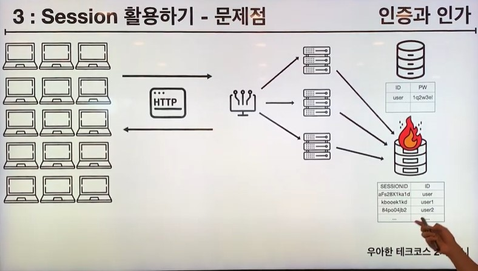
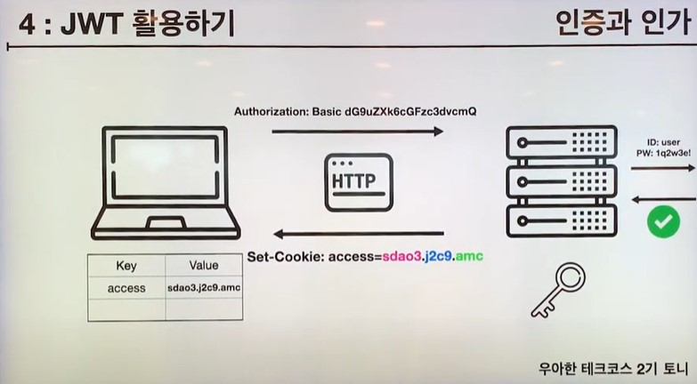

# 🔒인증과 인가

> https://www.youtube.com/watch?v=y0xMXlOAfss&t=377s
>
> 해당 글은 전부 해당 우아한 테크의 토니의 인증과 인가 영상의 내용과 자료들입니다.
>
> 정말 좋은 강의입니다. 인증과 인가에 대한 많은 강의를 들어봤지만 손에 꼽을 수 있을 만큼 잘 정리되어있는 강의라고 생각합니다. 때문에 제 글 보다는 해당 강의를 보는 것을 추천합니다.

---

1. 인증하기 Request Header
2. 인증 유지하기 Browser
3. 안전하게 인증하기 Server
4. 효율적으로 인증하기 Token
5. 다른 채널을 통해 인증하기 OAuth

---

### Request Header

기존의 URL의 구조는 다음과 같다는 것을 알아봤다.

`<스킴>://<사용자이름>:<비밀번호>@<호스트>:<포트>/<경로>;<파라미터>?<질의>#<프래그먼트>`

그때도 그랬지만 URL에 사용자이름과 비밀번호가 들어가는 이 형태는 굉장히 괴상하다.

하지만, 실제로 이런 식으로 유저네임과 비밀번호를 넘겨도 제대로 인가된다.

(Base64에 의해 인코딩되고 이 인코딩 된 값이 헤더에 담겨져서 넘어간다고 한다.)

하지만, Request Header의 가장 큰 문제는 매번 인증을 해야 한다는 것이다. 예를 들어 게시물을 생성할 때도 URL의 맨 앞에 내 아이디와 비밀번호를 적고, 수정할 때도 적고, 삭제할 때도 적는다면 너무나 귀찮은 일이 될 것이다.

---

### Browser

기존 Request Header의 문제를 해결하기 위해 우리는 브라우저 자체에서 데이터를 저장하게 되었다.

보통 쿠키나 스토리지에 아이디, 비밀번호 등과 같은 값을 저장해두고 알아서 인증하도록 만드는 것이다.

하지만, 이는 또 다른 문제를 발생시켰다. 바로, 쿠키나 스토리지에 저장된 값은 탈취가 굉장히 쉽다는 것이다. 

---

### Server

기존 Browser의 문제를 해결하기 위해 우리는 서버 자체(세션)에 데이터를 저장하게 되었다.

서버에 세션ID 값을 저장하고 이를 클라이언트에 넘겨주는 것이다. 클라이언트 또한 해당 값을 쿠키 혹은 스토리지에 저장해두고 사용하게 된다. 

이번에 쿠키 혹은 스토리지에 저장하게 되는 값은 사용자의 ID, 비밀번호가 아닌 세션ID이다. 세션ID가 탈취되더라도 이를 통해 아이디 혹은 비밀번호를 유추할 수는 없기 때문에 안전하다. 

> 탈취가 불가능하다는 것이 아니라 탈취되어도 상관없다는 것이다. 보안적으로 pure data를 보호하는 방법은 크게 2가지가 존재할 수 있다. 아예 pure data를 가져갈 수 없도록 만드는 방법과 가져가도 상관없게 pure data를 변형시키는 방법 이 2가지가 존재할 것이다.

하지만, 해당 방법도 분명한 문제를 가지게 된다.

여러 개의 서버를 두는 서비스라고 가정한다. 첫번째 요청을 로드밸런서에 의해 3번째 서버로 향했고 3번째 서버의 세션에 해당 ID에 대한 세션ID가 발급되어 저장되었다.

그 다음, 같은 아이디로 두번째 요청이 왔다. 하지만, 이번에는 로드밸런서에 의해 2번째 서버로 향한다. 이 경우 두번째 서버의 세션에는 해당 세션ID가 저장되어 있지 않고 오류가 나게 된다.

물론, 이 문제도 해결이 가능하다.

모든 서버의 세션 스토리지를 하나로 관리하는 것이다. 이렇게 되면 첫번째 요청이 3번째 서버에 들어가도 세션은 공통적으로 사용하는 세션 스토리지에 저장되기 떄문에 다음 요청이 3번쨰 서버가 아닌 다른 서버에 오더라도 문제를 일으키지 않는다.

하지만, 이 해결방안 또한 문제가 존재한다.

클라이언트의 개수가 굉장히 많아져서 요청이 엄청나게 많아진다면 하나 밖에 없는 세션 스토리지가 터지게 된다.

---

### 토큰

이 모든 문제들은 결국 HTTP 통신은 stateless 하지만 인증과 인가를 위해서는 stateful한 무언가가 필요하기 때문이다. 때문에 클라이언트를 stateful하게 관리 해보고, 서버를 stateful하게 관리 해보는 시도를 해온 것이다.

하지만, 클라이언트 혹은 서버를 stateful하게 관리하는 것은 이미 언급한 것처럼 많은 문제를 유발한다. 때문에 stateful하게 관리할 수 있으면서도 클라이언트나 서버가 아닌 것이 필요했고 이로 인해 토큰이라는 개념이 생기게 되었다.

1. 클라이언트는 사용자로부터 아이디와 비밀번호를 받아 서버에 보낸다.
2. 서버는 데이터베이스에 해당 아이디와 비밀번호가 저장되어있는지 확인하기 위한 요청을 보낸다.
3. 데이터베이스는 해당 요청을 처리하고 서버에 응답을 준다.
4. 서버는 데이터베이스에 해당 아이디와 비밀번호가 저장되어 있다는 응답을 받게 되면 토큰을 생성해서 클라이언트에 보낸다.
5. 클라이언트는 해당 토큰을 저장하고 매 요청시 서버에 토큰을 함께 보낸다.
6. 서버는 해당 토큰에 대한 유효성 검사(by. secretkey)를 수행하고 적절하다면 클라이언트로부터 온 요청을 처리한다.

토큰에는 사용자 정보 중에서도 이름, 만료시기, 권한 등이 저장된다. 비밀번호는 토큰에 저장하지 않는데 토큰은 상대적으로 디코딩하기 쉽기 때문에 이곳에 비밀번호를 담게 되면 위험하다.

---

물론, 토큰이 모든 문제를 해결하는 것은 아니다. 토큰 또한 탈취당하게 되면 해커가 사용자와 동등한 위치에 놓이게 될 수 있다는 문제를 갖는다. 때문에 우리는 토큰에 보통 만료기한을 지정하게 된다.

토큰에 만료기한을 지정하게 되면 이 또한 문제를 발생시키는데!!! 해커가 가져간 토큰만 만료되는게 아니라 사용자가 가지고 있는 토큰 또한 만료된다. 그렇게 되면 사용자는 만료기한마다 다시 재로그인을 해야 하는 불편한 상황에 놓이게 된다.

물론, 이 또한 해결 방법이 존재하며 리프레시 토큰을 사용하게 되면 이 문제를 해결할 수 있다. 해당 내용은 직접 경험한 것을 바탕으로 자세하게 설명한다.

> https://github.com/Dongkyun-Jang/TIL/blob/master/web/%F0%9F%92%A2%ED%8C%80%EA%B5%AC%20%ED%94%84%EB%A1%9C%EC%A0%9D%ED%8A%B8%EC%97%90%EC%84%9C%20%EB%A1%9C%EA%B7%B8%EC%9D%B8%20%EB%B6%80%EB%B6%84%EC%9D%84%20%EA%B5%AC%ED%98%84%ED%95%98%EB%A9%B4%EC%84%9C%20%ED%96%88%EB%8D%98%20%EA%B3%A0%EB%AF%BC%EB%93%A4.md
